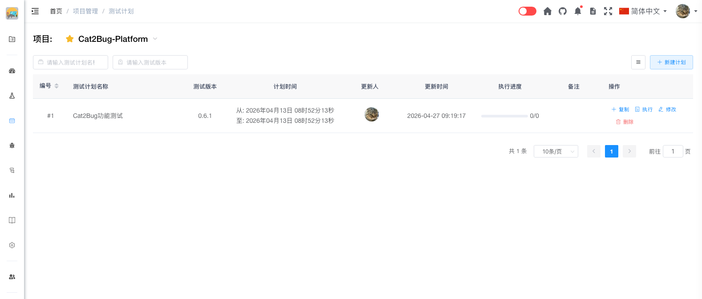

# 执行测试计划

测试计划创建完成后，测试人员可以按照计划执行测试用例，并记录测试结果。

## 查看测试计划

在测试计划列表中，可以查看所有的测试计划及其执行状态。

## 用例执行

测试人员按照计划执行测试用例：

### 1. 查看待执行用例

查看分配给自己的测试用例列表。

### 2. 执行测试

点击用例进入详情页，按照用例步骤执行测试。

### 3. 记录结果

执行完成后，记录测试结果（通过/失败/阻塞）。

### 4. 提交缺陷

如果测试失败，可以直接创建缺陷并关联到当前用例。

## 执行状态

测试用例的执行状态包括：

- **未执行** - 尚未开始执行
- **执行中** - 正在执行
- **通过** - 测试通过
- **失败** - 测试失败，需要提交缺陷
- **阻塞** - 由于某些原因无法执行
- **跳过** - 本次不执行

## 进度跟踪

实时查看测试计划的执行进度：

### 用例执行进度

显示已执行用例数和总用例数的比例。

### 通过率统计

显示通过用例数占已执行用例数的比例。

### 缺陷统计

统计测试过程中发现的缺陷数量和分布情况。

### 成员工作量

查看各成员执行的用例数量和完成情况。

## 执行技巧

> **提示：**
> 1. 按照用例优先级从高到低执行，确保核心功能优先测试
> 2. 遇到阻塞问题及时标记并沟通解决
> 3. 发现缺陷后及时提交，不要积压
> 4. 定期查看进度，确保按计划推进
> 5. 缺陷修复后及时进行回归测试
