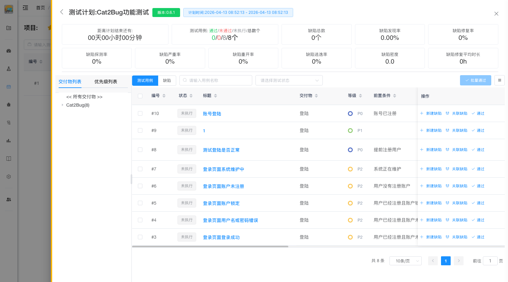

# 执行计划

计划创建完成后，测试人员可以按照计划执行测试用例，并记录测试结果。

## 测试计划详情介绍

在测试计划列表中，点击「执行」，可以查看选中的测试计划详情，其中页面元素包括：

* 计划标题：详情标题包含测试计划名称、版本、执行时间范围；
* 计划统计：标题下面显示的是计划、测试用例、缺陷相关的统计；
* 测试列表：计划统计下面的测试列表分为左右两侧，左侧显示测试的交付物、项目用例优先级，右侧显示测试用例、缺陷列表；

## 执行测试工作

测试人员按照交付物或优先级逐一进行各功能模块的测试。

### 1. 查看待执行用例

选择交付物中要测试的模块，右侧会刷新显示此模块关联的测试用例列表。

### 2. 执行测试

选中右侧测试用例的某一测试用例，按照用例步骤执行测试。

::: tip 提示
点击用例「标题」右侧会弹出测试用例详情
:::

### 3. 记录结果

测试完成后，记录测试结果：

* 测试未通过时：当测试未通过，且缺陷没有被录入过，点击缺陷列表右侧的「新建缺陷」按钮创建缺陷；
* 测试通过时：当测试通过，点击缺陷列表右侧的「通过」按钮将测试用例状态改为“通过”状态；
* 关联缺陷：当测试未通过，且当前系统中已经录入过相同缺陷时，点击缺陷列表右侧的「关联缺陷」按钮关联已存在的缺陷；

## 执行状态

测试用例的执行状态包括：

- **未执行** - 尚未开始执行
- **通过** - 测试通过
- **未通过** - 测试失败，需要提交缺陷

## 执行技巧

::: tip 提示
1. 按照用例优先级从高到低执行，确保核心功能优先测试
2. 遇到阻塞问题及时标记并沟通解决
3. 发现缺陷后及时提交，不要积压
4. 定期查看进度，确保按计划推进
5. 缺陷修复后及时进行回归测试
::: 
