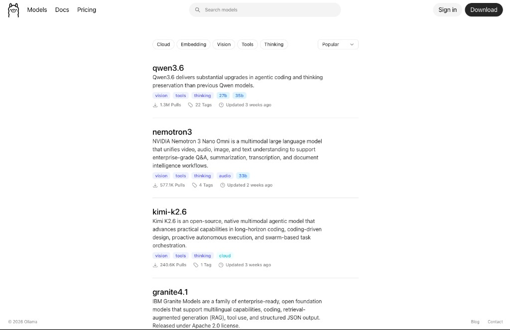
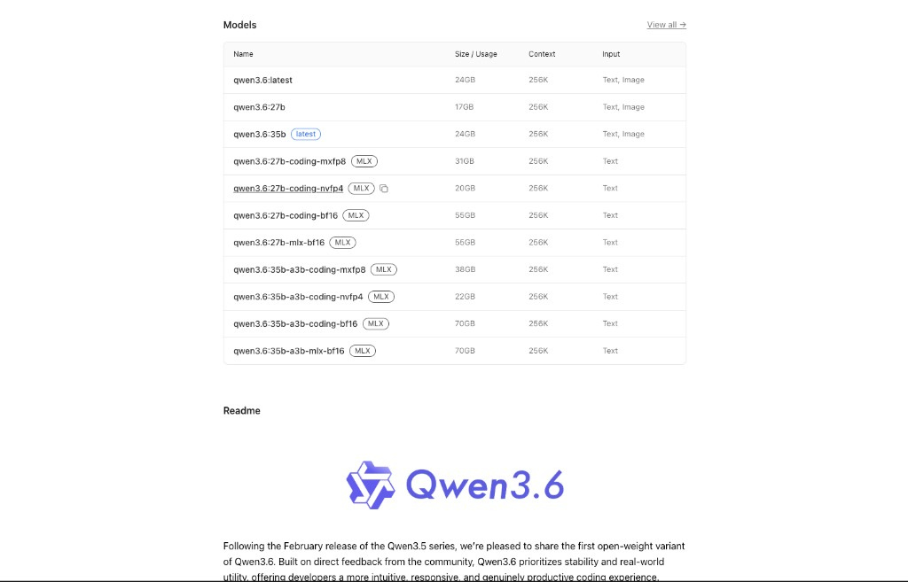
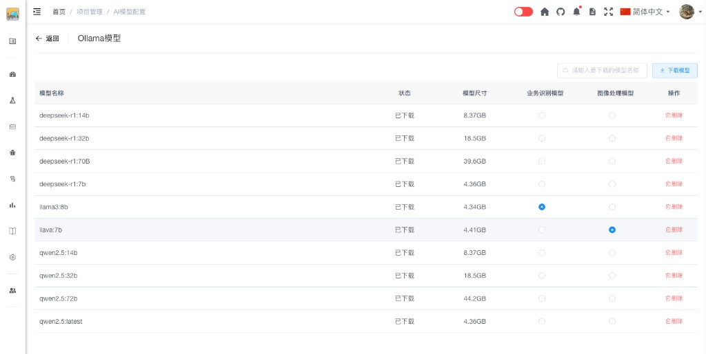
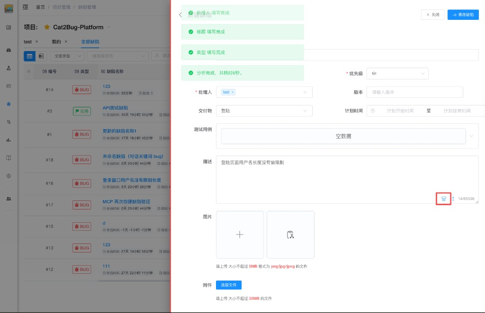

# Ollama模型 [/project/ollama](/project/ollama)

配置项目使用的AI大模型服务。系统集成了Ollama API，可以方便地管理和使用本地或远程的大语言模型。

## Ollama集成

Cat2Bug平台集成了Ollama API，支持通过接口维护和使用Ollama提供的各种开源大模型。

### 什么是Ollama

Ollama是一个轻量级的大模型运行框架，支持在本地运行多种开源大语言模型，如Llama、Mistral、Qwen等。更多信息见官网：[https://ollama.com](https://ollama.com)。通过Ollama，您可以：
- 在本地部署和运行大模型，保护数据隐私
- 无需依赖外部API服务，降低使用成本
- 支持多种开源模型，灵活选择

## 功能说明

**主要功能：**
- 配置Ollama服务地址
- 查看可用的AI模型列表
- 添加和删除AI模型
- 测试模型连接
- 设置默认使用的模型

**操作步骤：**

### 1. 从官网查找需要下载的模型

1. 打开 Ollama 官网模型检索页 [https://ollama.com/search](https://ollama.com/search)，按需搜索、筛选（如云、嵌入、视觉等），并记下要拉取的模型名称（如 `qwen3`、`llama3` 等），供后续在平台中「添加模型」时使用。

    

2. 在检索结果中进入目标模型的**详情页**，阅读模型说明，并对照表格中的 **Size / Usage**（体积与显存占用）、**Context**、**Input** 等字段，结合自身显存与磁盘空间选择合适标签（如 `:7b`、`:32b` 等）。同一模型常有多种量化与后缀（如 BF16、MLX），体积与精度不同，请以详情页为准。

    **硬件与规格参考（本地推理，实际以模型页展示与 Ollama 版本为准）：**
    - **约 8～12GB 显存**：优先 7B 及以下或强量化的小模型，留足系统与其它进程显存。
    - **24GB 级消费卡（如 RTX 4090）**：常见实践是优先 **32B 及以下**（常用量化档位下更稳妥）；34B～70B 往往需更强量化、更小上下文或速度明显受限，不建议作为默认选型。
    - **40GB 级数据中心卡（如 A100 40GB）**：可覆盖多数 **34B～70B** 档位的实用配置，仍建议以详情页 Size 为准。
    - **80GB 级（如 A100 80GB）**：更适合 **70B/72B 级**及更大上下文、更高精度的权重，仍应核对单卡是否放得下所选标签。

    上述区间综合了社区与硬件指南中对显存占用的经验归纳（量化与上下文会显著改变占用），详见如 [LLMHardware 等对 24GB 显卡与 7B～70B 档位的说明](https://llmhardware.io/guides/rtx-4090-llm-guide)。**若显存吃紧，宁可选更小参数或更高压缩的量化标签，再逐步提高规格。**

    

### 2. 管理AI模型

在步骤 1 中已确定要使用的模型及规格后，打开项目内的 「**Ollama模型**」页面。在页面**右上角**输入框中填写**模型名称与标签**（参数量/变体写在英文冒号后，相当于同时指定「名称 + 尺寸/规格」），例如输入 **`qwen3.6:27b`** 表示拉取 Qwen3.6 的 27B 档；填写完成后，点击输入框右侧的 「**下载模型**」 按钮即可开始拉取。下载完成后，模型会出现在下方列表中，可查看状态与占用空间，并可执行删除等操作。具体用于「缺陷 AI 补全」「AI 用例生成」等推理的模型，请在各功能界面中的**模型下拉框**内选择（默认优先已下载列表中的第一项 Ollama 模型；若无则使用 OpenAI 账号列表首项）。

## AI功能应用场景

配置 AI 后，可在项目中使用模型能力，常见场景分为以下两类。

### 1. 缺陷信息快速生成

在**新建**或**编辑**缺陷时，先在「缺陷描述」中输入内容，在描述框工具条中选择本次要使用的 **AI 模型**（Ollama 已下载模型或 OpenAI 账号），再点击**机器人**按钮。AI 会据此分析描述，并自动填充**项目名称**、**类型**、**处理人**、**交付物**等选项（以当前表单字段为准）。若未手动选择模型，系统会按已保存的最近选择与默认规则（优先第一项已下载 Ollama 模型）自动选定。

**说明：**当前版本在缺陷/用例侧统一通过上述模型选择器指定推理模型；**不提供**独立的「图像模型」推理配置项。若配置文件中仍存在与图像相关的默认模型键，仅可能用于服务启动时的可选拉取，**不代表**产品内存在单独的图像理解流水线。

### 2. 测试用例生成

在**测试用例**页面点击 「**AI用例生成**」 按钮打开弹窗，按界面提示输入提示词即可创建测试用例。具体操作步骤、字段说明与示例请见：[AI 用例生成](../../case/case-ai.md)。

## 权限说明

只有项目管理员才能配置AI大模型设置。

## 常见问题

**Q: 为什么选择Ollama而不是OpenAI？**  
A: Ollama支持本地部署，数据不会发送到外部服务器，更好地保护项目隐私。同时无需支付API费用，适合长期使用。

**Q: Ollama需要什么硬件配置？**  
A: 建议至少8GB内存，推荐16GB以上。GPU可以显著提升推理速度，但不是必需的。

**Q: 可以同时配置多个AI模型吗？**  
A: 可以。系统支持配置多个模型，可以根据不同场景选择使用。

**Q: AI模型连接测试失败怎么办？**  
A: 请检查Ollama服务是否正常运行、服务地址是否正确、网络连接是否正常、防火墙是否允许访问。

**Q: 使用本地AI模型会泄露项目数据吗？**  
A: 不会。使用Ollama本地部署的模型，所有数据都在本地处理，不会发送到外部服务器。

**Q: 模型下载很慢怎么办？**  
A: 可以使用国内镜像源，或者手动下载模型文件后导入Ollama。
