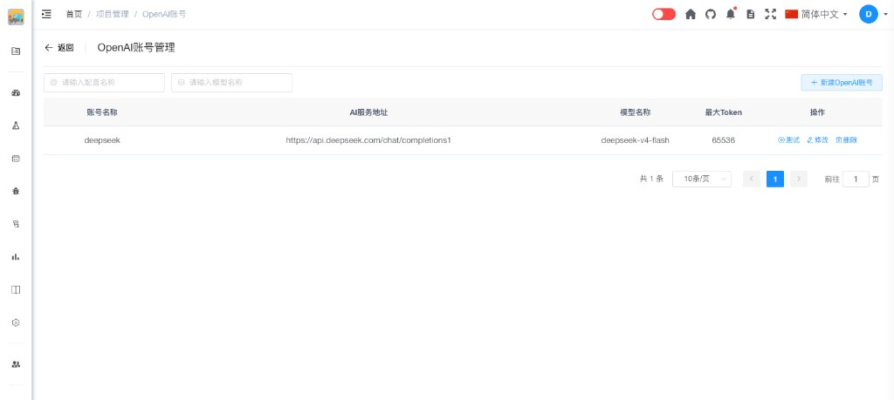

# OpenAI账号管理 [/project/openai](/project/openai)

管理项目内兼容 OpenAI Chat Completions 接口的 AI 账号（含 OpenAI、DeepSeek 等），供缺陷 AI 补全、AI 用例生成等功能在模型下拉框中选择使用。

## 功能

- 新建、修改、删除 AI 账号配置
- 配置 AI 服务地址、模型名称、API 密钥与最大 Token
- 连接测试，验证账号是否可用

## 操作步骤

1. 进入项目 **项目设置 → AI管理**，点击 **OpenAI账号管理**（或访问 [/project/openai](/project/openai)）。
2. 点击右上角 **新建OpenAI账号**，填写配置项并保存。
3. 在列表 **操作** 列点击 **测试**，系统会调用该账号发起一次连通性检测；成功则提示测试成功，失败会显示错误原因。
4. 在缺陷新建/编辑、AI 用例生成等页面的 **模型** 下拉框中选择已配置的账号。

## 键盘快捷键

| 按键 | 作用 |
|------|------|
| **B** / **Esc** | 返回 AI 管理 |
| **S** | 聚焦查询区（← / → 在查询项与「新建」间切换） |
| **E** | 新建 OpenAI 账号 |
| **U** / **P** | 上一页 / 下一页 |
| 按住 **⌘/Ctrl** + 动态字母 | 当前可见行账号名称列显示徽标（优先 `1`–`9`），按字母 **修改** 该行账号 |

**新建/修改弹框内：**

| 按键 | 作用 |
|------|------|
| **Esc** | 关闭弹框（有未保存修改时确认） |
| **⌘/Ctrl + Enter** | 保存 |
| 按住 **⌘/Ctrl** + 字母 | 聚焦对应表单字段 |

### 测试连接

配置保存后，无需离开本页即可验证是否可用：在账号列表右侧 **操作** 列点击 **测试** 按钮。测试通过表示 AI 服务地址、模型名称与密钥配置正确，且当前环境可访问该接口；若失败请根据提示检查网址、密钥与模型名，或确认服务器外网连通性。

## 配置项说明

| 配置项 | 说明 |
|--------|------|
| **账号名称** | 在本项目内的显示名称，便于区分多个账号 |
| **AI服务地址** | 完整的 Chat Completions 请求地址（POST），需与服务商文档一致 |
| **模型名称** | 接口要求的 `model` 参数，如 `gpt-4o`、`deepseek-v4-flash` |
| **最大Token** | 单次补全允许的最大 completion token 数 |
| **密钥** | API Key，请求头中以 `Bearer` 方式携带 |

::: tip 提示
「AI服务地址」须填写**完整 URL**（含路径），系统将向该地址直接 POST JSON 请求，而非仅填写域名。
:::

## 配置示例：DeepSeek

DeepSeek 提供与 OpenAI 兼容的 Chat Completions 接口，可按下列示例填写（模型与地址以 [DeepSeek 官网](https://www.deepseek.com) 及开放平台当前说明为准）：

| 配置项 | 示例值 |
|--------|--------|
| **账号名称** | `deepseek`（便于识别的名称即可） |
| **AI服务地址** | `https://api.deepseek.com/chat/completions1` |
| **模型名称** | `deepseek-v4-flash` |
| **最大Token** | `65536`（或按业务需要调整） |
| **密钥** | 在 DeepSeek 开放平台创建的 API Key |

**说明：**

- 官网：[https://www.deepseek.com](https://www.deepseek.com)
- 在官网注册并开通 API 后，于控制台创建密钥，填入本页的 **密钥** 字段。
- 若接口或模型名称有更新，请以 DeepSeek 官方文档为准，同步修改 **AI服务地址** 与 **模型名称**。

## 权限说明

只有项目管理员才能配置 OpenAI 账号。

## 常见问题

**Q: 如何获取 OpenAI API 密钥？**  
A: 访问 [OpenAI 平台](https://platform.openai.com)，注册后在 API Keys 页面创建密钥；**AI服务地址** 一般填写 `https://api.openai.com/v1/chat/completions`，**模型名称** 填写所用模型（如 `gpt-4o`）。

**Q: DeepSeek 与 OpenAI 能否同时配置？**  
A: 可以。每个账号独立保存，在功能页面的模型下拉框中分别选择即可。

**Q: 测试连接失败怎么办？**  
A: 检查 AI 服务地址是否完整、密钥是否有效、模型名称是否与服务商一致，以及服务器能否访问外网；可先使用列表中的 **测试** 按钮定位问题。
