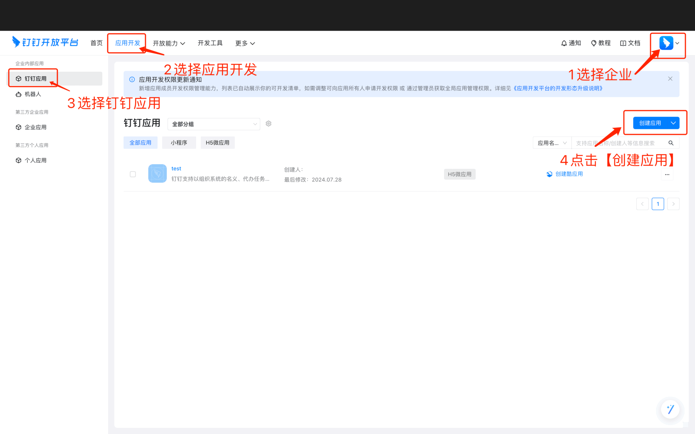
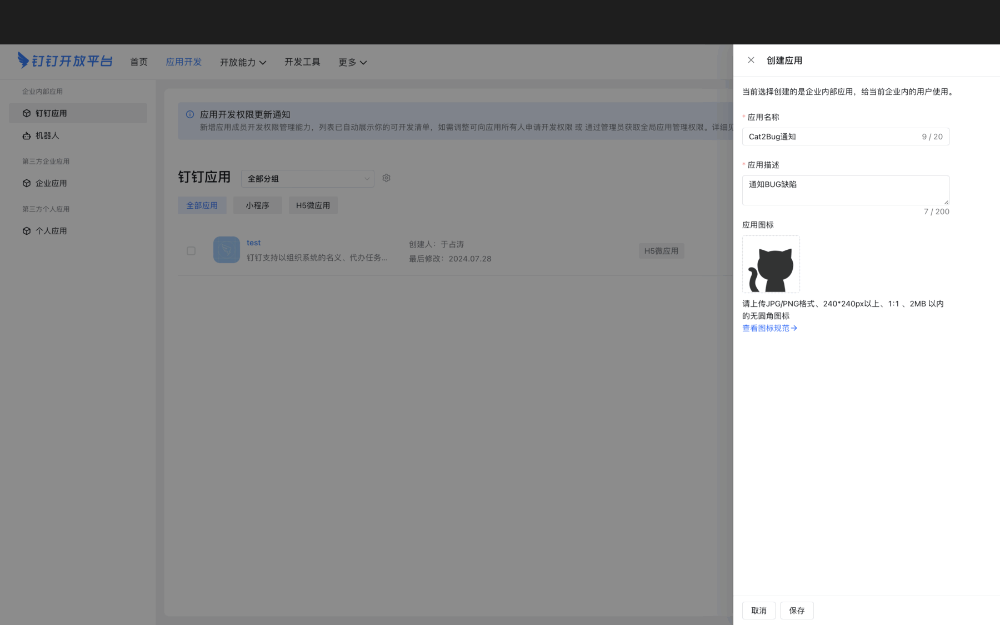
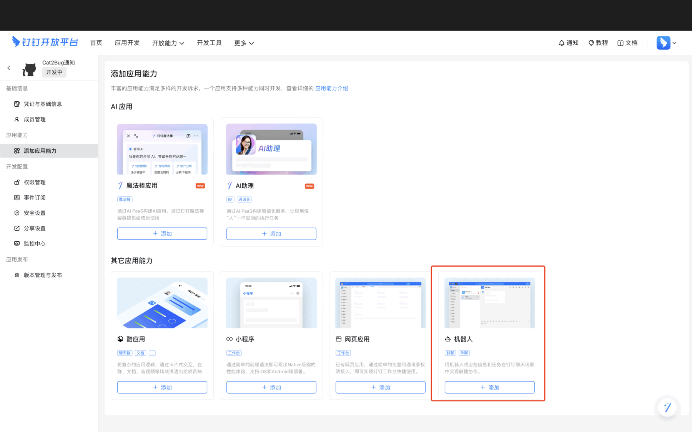
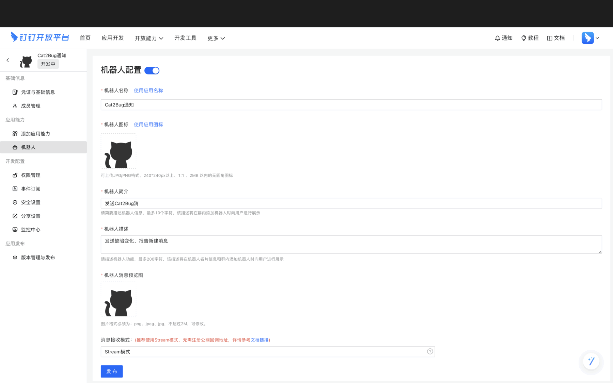
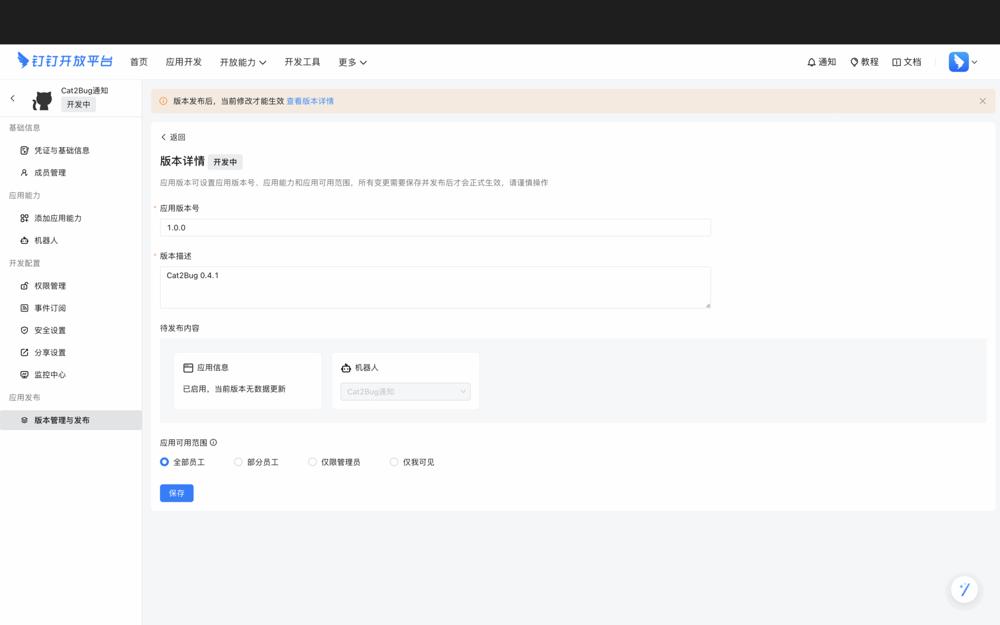
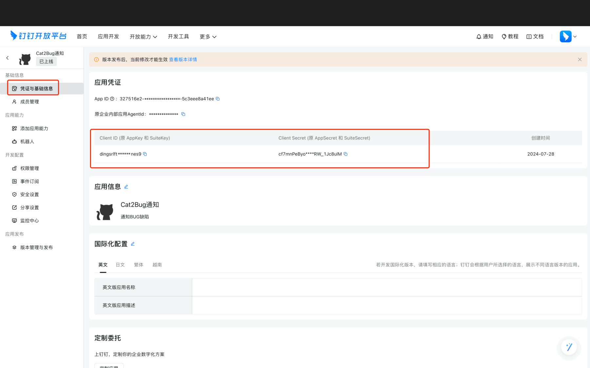
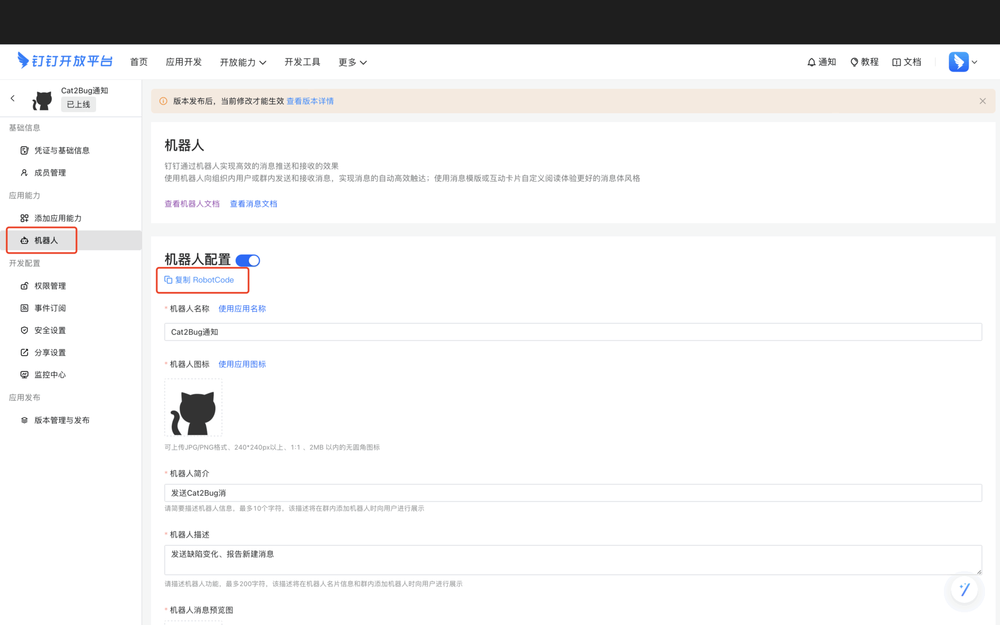
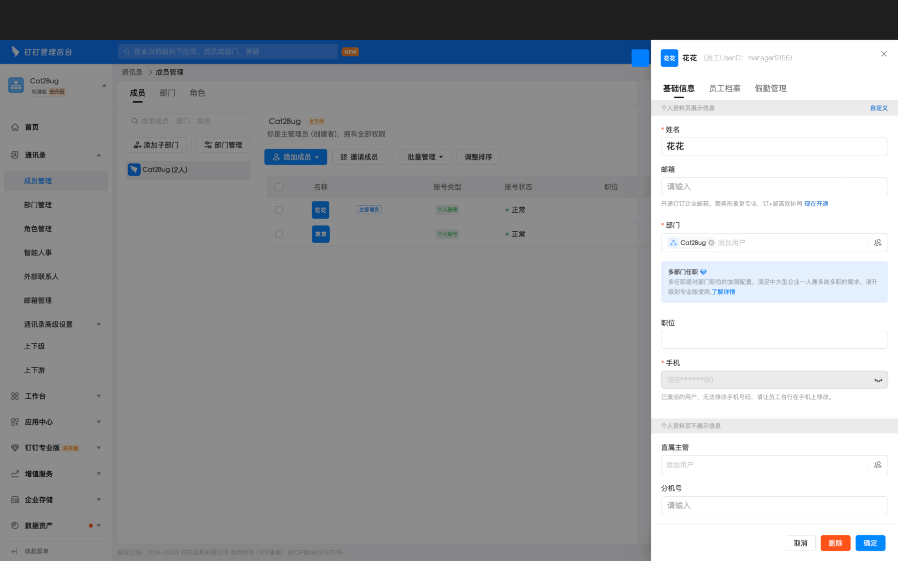
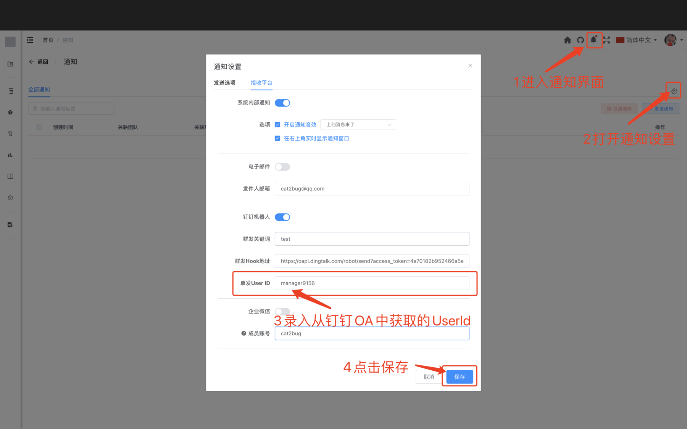

# 钉钉 [/project/ding](/project/ding)

项目管理员在本页配置钉钉**企业应用与机器人**，用于向成员**单发**个人通知。成员在「通知设置」中配置手机号或群 Webhook 后，即可接收缺陷、报告等系统消息。

配置页左侧为保存项，右侧为**钉钉配置说明**（与系统内页面一致）。下文按页面选项整理。

## 页面配置项

| 配置项 | 说明 |
|--------|------|
| **Client ID** | 钉钉开放平台应用的 Client ID（原 AppKey） |
| **Client Secret** | 应用 Client Secret（原 AppSecret） |
| **Robot Code** | 应用内机器人的 Robot Code |

三项均为必填，填写后点击 **保存**。

::: tip 说明
单发能力通过钉钉【人与机器人会话】接口实现。标准版累计约 1 万次/月；更多调用量可升级钉钉专业版。详见页面右侧说明。
:::

## 钉钉开发者平台配置

按配置页 **「钉钉开发者平台配置」** 章节操作：

1. 使用**企业管理员**账号登录 [钉钉开发者平台](https://open-dev.dingtalk.com)。
2. 创建应用（见下图步骤）。

3. 填写应用信息后点击 **保存**。

4. 点击 **添加应用能力**，为应用添加**机器人**服务。

5. 按需求配置机器人选项。

6. 发布版本，使应用处于 **已上线** 状态。

7. 将 **Client ID**、**Client Secret** 填入本页左侧对应栏位。

8. 将 **Robot Code** 填入左侧 **Robot Code** 栏位。

9. 点击 **保存** 完成项目级配置。

## 配置成员接收（单发）

单发需成员在钉钉组织内存在有效信息，并在 Cat2Bug 个人通知中配置：

1. 管理员登录 [钉钉 OA](https://oa.dingtalk.com)，在 **通讯录 → 成员管理** 中打开成员，复制其 **UserId**（或通过手机号由系统自动解析，见用户通知配置）。
2. 成员在 Cat2Bug：**通知图标 → 配置 → 接收平台 → 钉钉**，开启 **单发配置**，填写 **企业用户手机号**，保存并 **单发测试**。

未在个人通知中配置时，将使用 **个人中心** 中的默认钉钉 User ID。

## 群消息（可选）

无需项目应用也可接收群通知：成员在通知设置中开启 **群发配置**，填写群机器人 **Webhook 地址**，以及机器人安全设置中的 **自定义关键词** 或 **加签**（二选一即可）。详见 [钉钉通知](../../user-management/notification/dingtalk-notification.md)。

## 权限说明

仅**项目管理员**可进入本页保存钉钉应用配置。

## 常见问题

**Q: 单发测试失败？**  
A: 确认 Client ID、Client Secret、Robot Code 与开放平台一致，应用已上线，成员手机号/UserId 正确，且成员已加入企业。

**Q: 与群发 Webhook 有何区别？**  
A: 本页配置用于**企业应用单发**；群 Webhook 在成员 **通知设置 → 钉钉 → 群发配置** 中填写，二者可同时使用。
