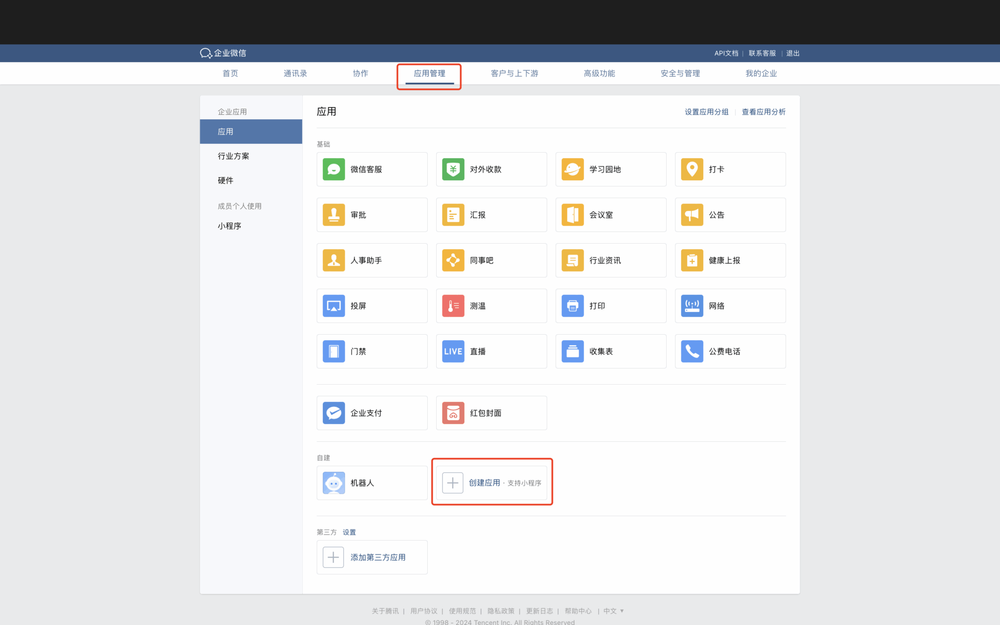
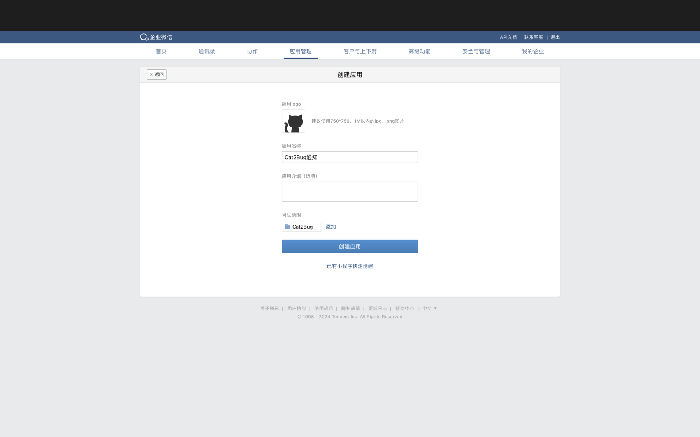
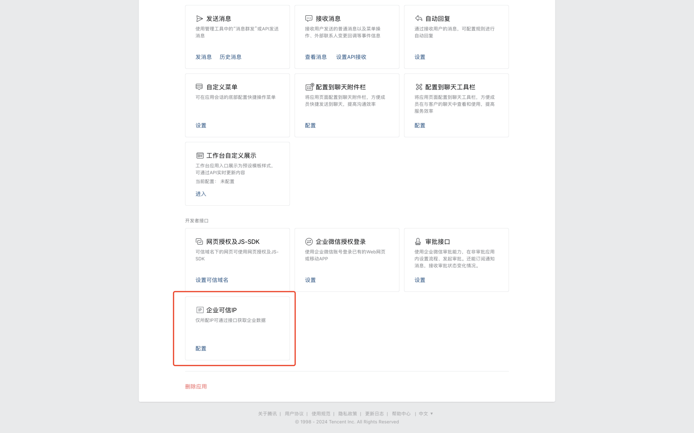
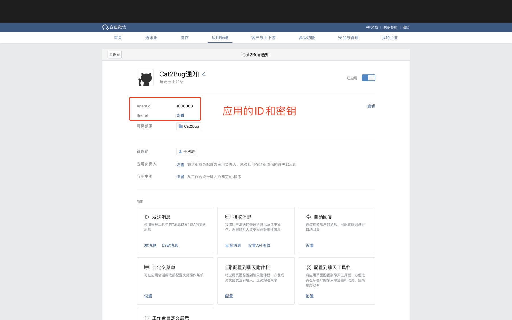
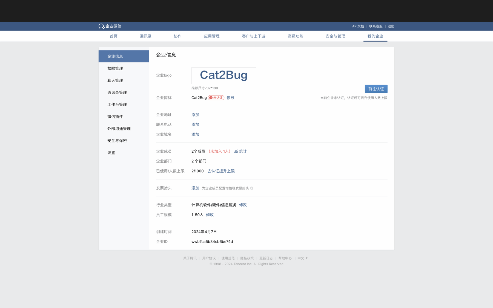
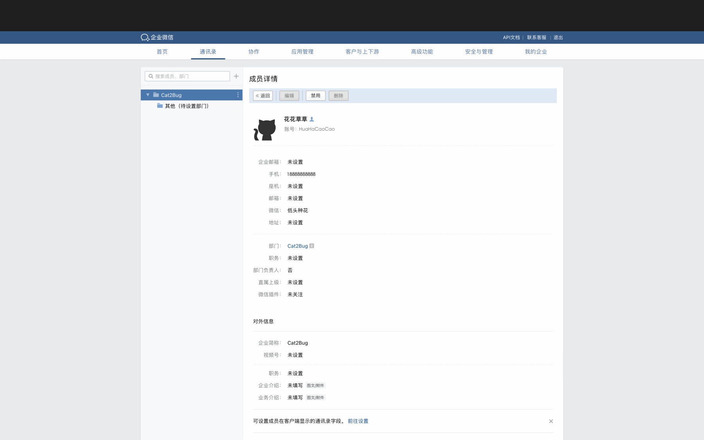
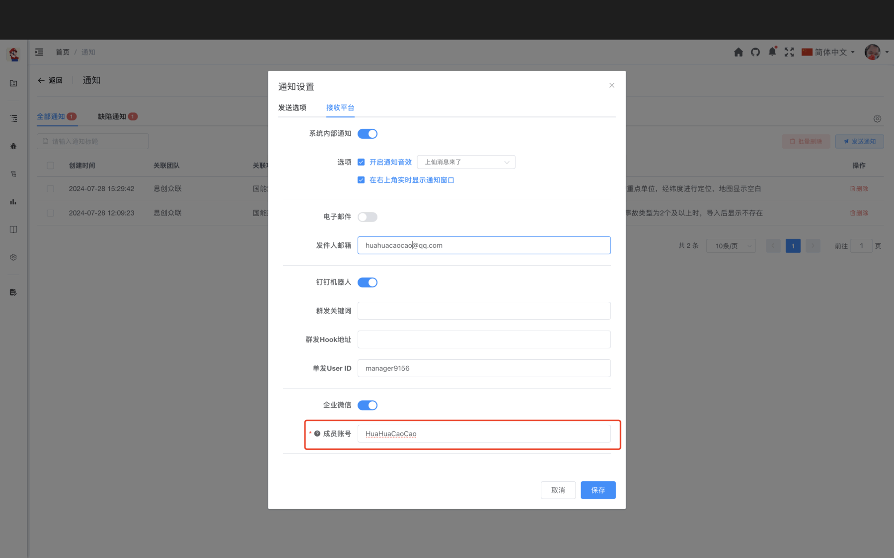

# 企业微信 [/project/enterprise-wechat](/project/enterprise-wechat)

项目管理员在本页配置企业微信**自建应用**，用于通过 **消息推送** 接口向成员**单发**通知。成员在「通知设置」中配置成员账号或群机器人后，即可接收缺陷、报告等消息。

配置页左侧为保存项，右侧为 **企业微信配置说明**（与系统内页面一致）。

## 页面配置项

| 配置项 | 说明 |
|--------|------|
| **企业ID** | 企业微信「我的企业」中的企业 ID |
| **应用ID** | 自建应用的 AgentId |
| **应用凭证** | 自建应用的 Secret |

三项均为必填，填写后点击 **保存**。

## 企业微信平台配置

按配置页 **「企业微信平台配置」** 章节操作：

1. 使用**企业管理员**登录 [企业微信管理后台](https://work.weixin.qq.com)。
2. 进入 **应用管理**，点击 **创建应用**。

3. 上传图标、填写应用名称，**可见范围**选择需接收消息的部门，点击 **创建应用**。

4. 在应用内配置 **企业可信 IP**（须为 Cat2Bug 平台对外的公网 IP，未配置将无法收到通知）。

5. 将应用详情中的 **AgentId** 填入本页 **应用ID**，**Secret** 填入 **应用凭证**。

6. 在 **我的企业** 中复制 **企业ID** 填入本页 **企业ID**，点击 **保存**。

## 配置成员接收（单发）

1. 管理员在 **通讯录** 中打开成员，复制其**成员账号**。
2. 成员在 Cat2Bug：**通知图标 → 配置 → 接收平台 → 企业微信**，开启 **单发配置**，填写 **成员账号**（或手机号，以通知页选项为准），保存并测试。

未在个人通知中配置时，将使用 **个人中心** 中的默认企业微信账号。

## 群消息（可选）

成员可在通知设置中开启 **群发配置**，使用群机器人 Webhook 接收群消息，无需依赖本页应用配置。详见 [企业微信通知](../../user-management/notification/wecom-notification.md)。

## 权限说明

仅**项目管理员**可保存企业微信应用配置。

## 常见问题

**Q: 收不到单发消息？**  
A: 检查可信 IP、企业ID / 应用ID / 应用凭证是否正确，应用可见范围是否包含该成员，成员账号是否填写正确。

**Q: 单发与群机器人区别？**  
A: 本页用于**应用 API 单发**；群机器人在成员 **通知设置 → 企业微信 → 群发配置** 中配置 Webhook。
