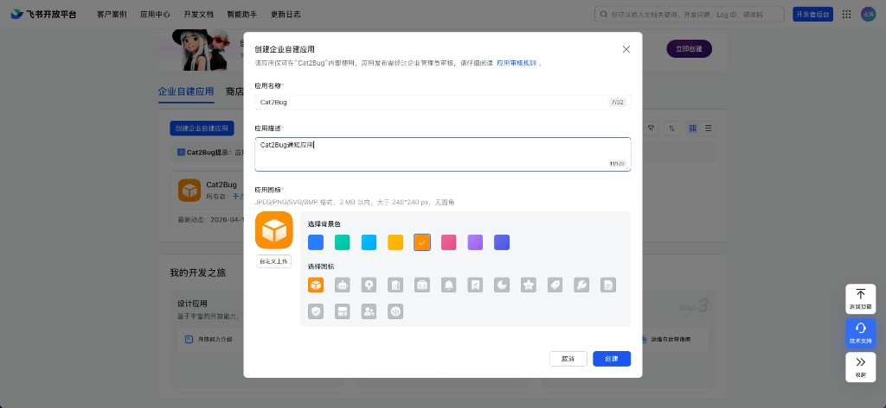
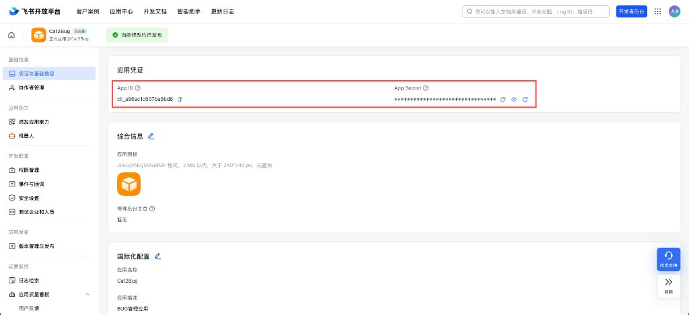
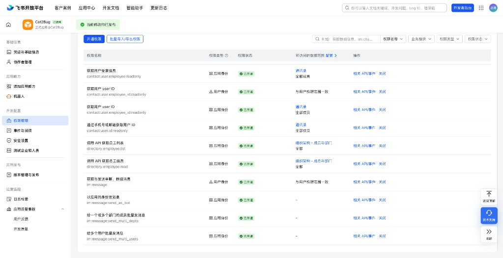
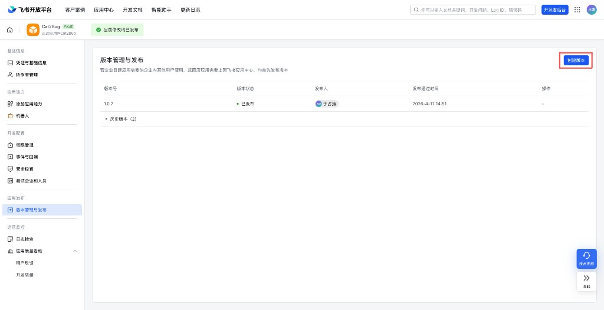

# 飞书 [/project/feishu](/project/feishu)

项目管理员在本页配置飞书**企业自建应用**，用于通过开放平台向指定用户**单发**消息。成员在「通知设置」中配置飞书邮箱或群机器人后，即可接收系统通知。

配置页左侧为保存项，右侧为 **飞书企业应用配置说明**（与系统内页面一致）。

## 页面配置项

| 配置项 | 说明 |
|--------|------|
| **应用 ID** | 飞书开放平台企业自建应用的 App ID |
| **应用密钥** | 对应应用的 App Secret |

两项均为必填，填写后点击 **保存**。

## 飞书企业自建应用配置

按配置页 **「飞书企业自建应用配置」** 章节操作：

### 1. 创建企业自建应用

登录 [飞书开放平台](https://open.feishu.cn)，进入 **开发者后台 → 企业自建应用**，点击 **创建企业自建应用**，填写应用名称、描述并选择图标后点击 **创建**。

### 2. 获取应用凭证

进入应用 **基础信息 → 凭证与基础信息**，复制 **App ID**、**App Secret**（可点击显示/复制）。

将 **App ID** 填入 Cat2Bug 本页 **应用 ID**，**App Secret** 填入 **应用密钥**。

### 3. 开通权限

进入 **开发配置 → 权限管理**，开通下列权限（状态应为 **已开通**）。可通过 **开通权限** 或 **批量导入/导出权限** 添加。

| 权限名称 | 权限标识 | 权限类型 | 数据范围（示例） |
|----------|----------|----------|------------------|
| 获取 user_access_token 基本信息 | `auth:user_access_token:read` | 应用身份 | - |
| 获取通讯录基本信息 | `contact:contact.base:readonly` | 应用身份 | 全部成员 |
| 获取用户受雇信息 | `contact:user.employee:readonly` | 应用身份 | 全部成员 |
| 获取用户 user ID | `contact:user.employee_id:readonly` | 用户身份 | 与用户权限范围一致 |
| 获取用户 user ID | `contact:user.employee_id:readonly` | 应用身份 | 全部成员 |
| 通过手机号或邮箱获取用户 ID | `contact:user.id:readonly` | 应用身份 | 全部成员 |
| 调用 API 获取员工列表 | `directory:employee:list` | 应用身份 | 全部 |
| 调用 API 获取员工信息 | `directory:employee:read` | 应用身份 | 全部 |
| 获取与发送单聊、群组消息 | `im:message` | 用户身份 | 与用户权限范围一致 |
| 以应用的身份发消息 | `im:message:send_as_bot` | 应用身份 | - |
| 给一个或多个部门的成员批量发消息 | `im:message:send_multi_depts` | 应用身份 | - |
| 给多个用户批量发消息 | `im:message:send_multi_users` | 应用身份 | - |

::: tip 提示
单发通知依赖 **以应用的身份发消息**（`im:message:send_as_bot`）及通讯录、用户 ID 相关权限；通过手机号查询用户需 **通过手机号或邮箱获取用户 ID**（`contact:user.id:readonly`）。
:::

### 4. 发布应用版本

进入 **应用发布 → 版本管理与发布**，点击 **创建版本**，填写版本说明后提交并发布，使应用在企业内可用（页面显示 **已发布** 或「当前修改均已发布」）。

### 5. 保存 Cat2Bug 配置

回到 Cat2Bug **项目设置 → 第三方应用 → 飞书**，确认 **应用 ID**、**应用密钥** 已填写，点击 **保存**。

## 通知说明

配置完成后：

- **企业应用单发**：成员在 Cat2Bug **通知设置 → 接收平台 → 飞书** 中开启 **单发配置**，填写飞书**用户邮箱**或**企业用户手机号**（系统通过开放平台接口发送个人消息）。操作详见 [飞书通知](../../user-management/notification/feishu-notification.md)。
- **群机器人（可选）**：成员也可在通知设置中填写飞书群 **Webhook 地址** 与 **关键词**，无需本页企业应用即可接收群消息。

## 权限说明

仅**项目管理员**可保存飞书企业应用配置。

## 常见问题

**Q: 单发测试失败？**  
A: 确认应用版本已发布、上表权限均已开通，成员邮箱/手机号与飞书账号一致，且 App ID / App Secret 填写正确。

**Q: 是否必须配置企业应用？**  
A: 仅**单发**到个人需要本页配置；仅使用群 Webhook 时，成员在通知设置中配置群机器人即可。

**Q: 修改权限后仍无法发消息？**  
A: 权限变更后需重新 **创建版本并发布**，企业内才会生效。
