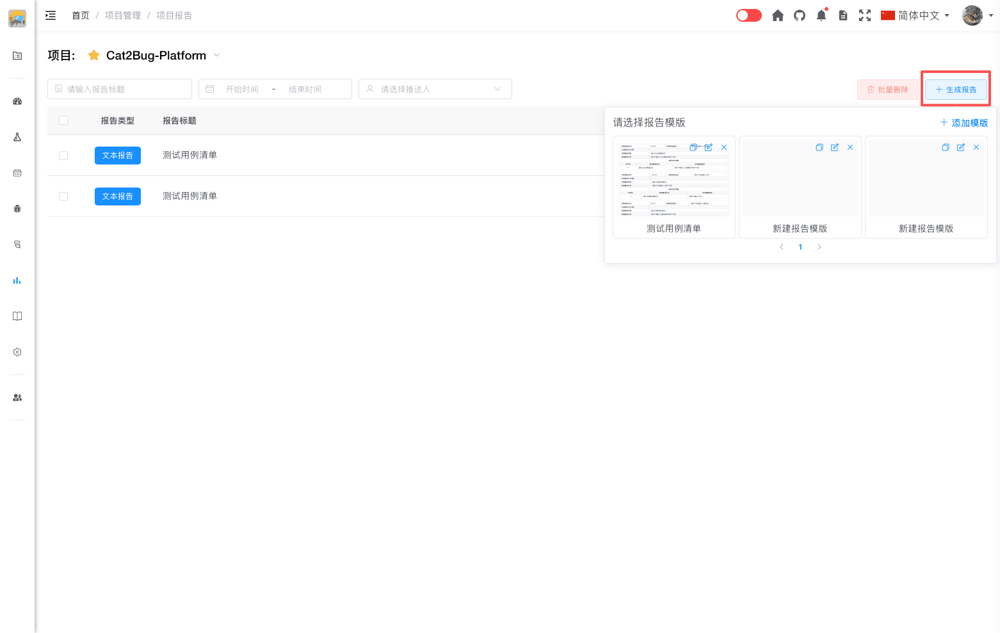

# 通过模版创建报告

通过选择报告模版快速创建测试报告，使用预定义的格式和结构。

## 使用场景

- 快速生成标准化报告
- 使用团队统一的报告格式
- 基于模版定制报告内容
- 手动编辑报告细节

## 操作步骤

### 1. 进入模版列表

在报告管理页面，点击「生成报告」按钮，下拉显示模版列表页面。

模版以卡片形式展示，每个卡片包含：
- **模版缩略图** - 模版内容的预览图
- **模版标题** - 模版的名称

### 2. 选择模版

浏览模版列表，点击要使用的模版卡片。

**选择建议：**
- 根据报告类型选择对应的模版
- 查看模版缩略图了解内容结构
- 选择符合当前测试阶段的模版

### 3. 生成报告

点击模版后，系统会：
1. 基于模版创建新的报告
2. 自动填充系统数据（如果模版中包含数据插入标记）
3. 报告创建完成，可在报告列表中查看

## 报告类型

通过模版创建的报告为**文本报告**，特点：
- 内容为静态文本
- 可以手动编辑所有内容
- 数据不会自动更新
- 适合需要人工审核和调整的报告

## 常见问题

### Q: 通过模版创建的报告可以修改吗？

A: 不可以。报告是记录当前时刻的业务信息，生成后不能修改，以保证数据的真实性和可追溯性。

### Q: 模版中的数据会自动更新吗？

A: 不会。通过模版创建报告时，系统会填充当前的数据，但之后数据不会自动更新。如果需要实时更新的数据，请使用 API 创建实时报告。

### Q: 可以基于报告创建新模版吗？

A: 目前不支持直接将报告转换为模版。但可以复制报告内容，然后在模版编辑页面粘贴创建新模版。

::: tip 提示
1. 通过模版创建的报告为文本报告，内容不会自动更新
2. 报告生成后不可修改，以保证数据真实性
3. 建议根据测试类型选择对应的模版
4. 如需创建新模版，请参考[添加模版](template-create.md)
:::
