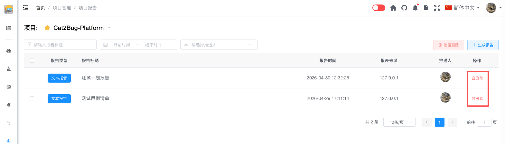

# 删除报告

删除不再需要的测试报告。

## 使用场景

- 删除测试报告草稿
- 清理过期的报告
- 删除错误的报告
- 测试数据清理

## 操作步骤

### 单个删除

#### 1. 找到要删除的报告

在报告列表中找到要删除的报告。

#### 2. 点击删除按钮

点击报告右侧的「删除」按钮。

#### 3. 确认删除

在弹出的确认对话框中，确认删除操作。

#### 4. 完成删除

系统删除报告并刷新列表。

## 删除影响

删除报告会导致：

- ❌ 报告内容永久删除，无法恢复

**不会影响：**
- ✅ 测试用例数据
- ✅ 缺陷数据
- ✅ 交付物数据
- ✅ 其他报告

::: tip 提示
1. 删除操作不可恢复，请谨慎操作
2. 重要报告建议先导出备份再删除
3. 建议定期清理过期报告，保持列表整洁
:::
