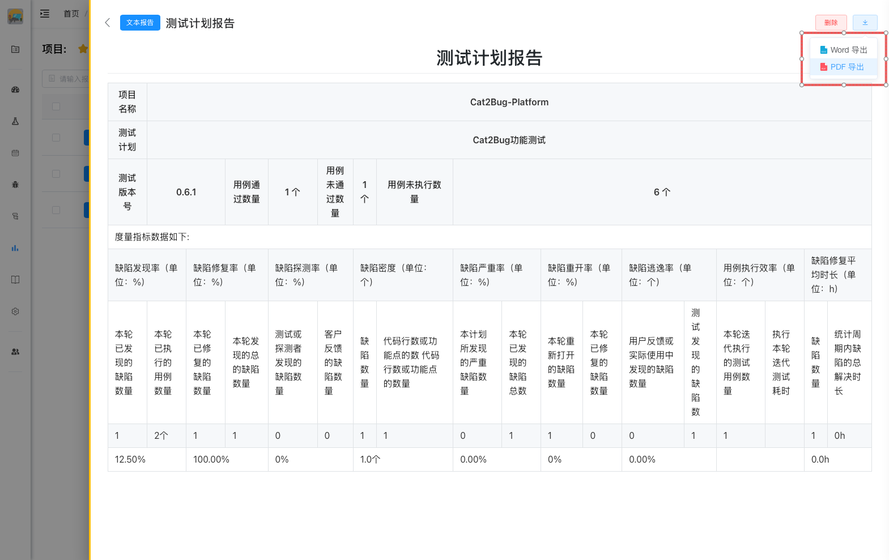

# 导出报告

将测试报告导出为 Word 或 PDF 格式，用于分享和存档。

## 使用场景

- 项目汇报需要报告文档
- 分享报告给外部人员
- 归档测试报告
- 打印报告文档

## 导出格式

### Word 格式

导出为 Word 文档（.docx 格式）。

**Word 格式特点：**
- ✅ 可以继续编辑
- ✅ 支持添加批注
- ✅ 适合内部流转
- ✅ 可以调整格式
- ❌ 文件较大
- ❌ 格式可能变化

**适用场景：**
- 需要进一步编辑报告内容
- 需要添加批注和意见
- 内部审核和流转
- 需要调整报告格式

### PDF 格式

导出为 PDF 文档（.pdf 格式）。

**PDF 格式特点：**
- ✅ 格式固定，不可编辑
- ✅ 跨平台兼容性好
- ✅ 适合正式发布
- ✅ 文件较小
- ✅ 打印效果好
- ❌ 不能编辑内容

**适用场景：**
- 正式发布和分享
- 归档保存
- 打印文档
- 分享给外部人员

## 导出步骤

### 单个报告导出

#### 1. 打开报告详情

在报告列表中点击报告标题，打开报告详情页面。

#### 2. 点击导出按钮

点击报告详情页右上角的【导出】按钮。



#### 3. 选择导出格式

在弹出的对话框中选择导出格式：
- Word 格式
- PDF 格式

#### 4. 等待生成

系统开始生成导出文件，显示生成进度。

**生成时间：**
- 小型报告（< 10 页）：约 5-10 秒
- 中型报告（10-50 页）：约 10-30 秒
- 大型报告（> 50 页）：约 30-60 秒

#### 5. 下载文件

生成完成后，自动下载导出文件到本地。

### 批量导出

#### 1. 选择报告

在报告列表中勾选要导出的多个报告。

#### 2. 点击批量导出

点击列表上方的【批量导出】按钮。

#### 3. 选择导出格式

选择导出格式（Word / PDF）。

#### 4. 等待生成

系统将多个报告打包成 ZIP 文件。

**打包规则：**
- 每个报告单独生成文件
- 文件名为报告标题
- 所有文件打包成一个 ZIP

#### 5. 下载压缩包

生成完成后，下载 ZIP 压缩包到本地。

## 导出内容

导出的报告包含以下内容：

### 报告正文

- 报告标题
- 测试概述
- 测试执行情况
- 缺陷统计
- 模块质量分析
- 测试结论
- 改进建议

### 图表

- 用例执行情况图表
- 缺陷分布图表
- 质量趋势图表
- 模块对比图表

### 格式保留

- Markdown 格式转换为对应的文档格式
- 标题层级保留
- 列表格式保留
- 表格格式保留
- 图片嵌入文档

## 导出设置

### 页面设置

**Word 格式：**
- 纸张大小：A4
- 页边距：上下 2.54cm，左右 3.17cm
- 页眉页脚：包含页码和报告标题

**PDF 格式：**
- 纸张大小：A4
- 页边距：上下 2.54cm，左右 3.17cm
- 页眉页脚：包含页码和报告标题

### 样式设置

**标题样式：**
- 一级标题：黑体，18pt，加粗
- 二级标题：黑体，16pt，加粗
- 三级标题：黑体，14pt，加粗

**正文样式：**
- 字体：宋体
- 字号：12pt
- 行距：1.5 倍

**表格样式：**
- 边框：实线，0.5pt
- 表头：灰色背景，加粗
- 单元格：左对齐

## 导出失败处理

### 常见失败原因

**1. 报告内容过大**
- 原因：报告内容超过系统限制
- 解决：简化报告内容，删除不必要的图表

**2. 报告格式有误**
- 原因：Markdown 格式不正确
- 解决：检查并修正 Markdown 语法

**3. 网络问题**
- 原因：网络中断导致导出失败
- 解决：检查网络连接，重试导出

**4. 服务器繁忙**
- 原因：同时导出的请求过多
- 解决：稍后重试

### 重试导出

如果导出失败，可以重试：

1. 关闭失败提示
2. 再次点击【导出】按钮
3. 重新选择导出格式
4. 等待生成完成

## 导出文件管理

### 文件命名

导出的文件自动命名：

**命名规则：**
```
{报告标题}_{导出时间}.{格式}
```

**示例：**
```
V1.0版本测试报告_20240115.pdf
V1.0版本测试报告_20240115.docx
```

### 文件存储

**本地存储：**
- 文件下载到浏览器默认下载目录
- 建议创建专门的文件夹存储报告
- 定期整理和归档

**云端存储：**
- 可以上传到云盘备份
- 便于团队共享
- 防止文件丢失

## 最佳实践

### 导出前检查

1. **检查报告内容**
   - 确认数据准确
   - 检查格式正确
   - 验证图表清晰

2. **选择合适格式**
   - 需要编辑选 Word
   - 正式发布选 PDF
   - 打印文档选 PDF

3. **测试导出效果**
   - 先导出预览
   - 检查格式是否正确
   - 确认内容完整

### 导出后处理

1. **Word 格式后处理**
   - 调整页面布局
   - 添加封面和目录
   - 添加批注和意见
   - 转换为 PDF 发布

2. **PDF 格式后处理**
   - 检查打印效果
   - 添加水印（如需要）
   - 设置文档属性
   - 加密保护（如需要）

### 文件分享

1. **内部分享**
   - 上传到团队共享空间
   - 通过企业邮箱发送
   - 使用内部文档系统

2. **外部分享**
   - 优先使用 PDF 格式
   - 检查是否包含敏感信息
   - 添加水印标识
   - 设置文档权限

::: tip 提示
1. PDF 格式适合正式发布和分享
2. Word 格式适合需要继续编辑的场景
3. 批量导出会打包成 ZIP 文件
4. 导出失败可以重试，不影响原报告
5. 建议定期导出报告进行归档备份
:::
