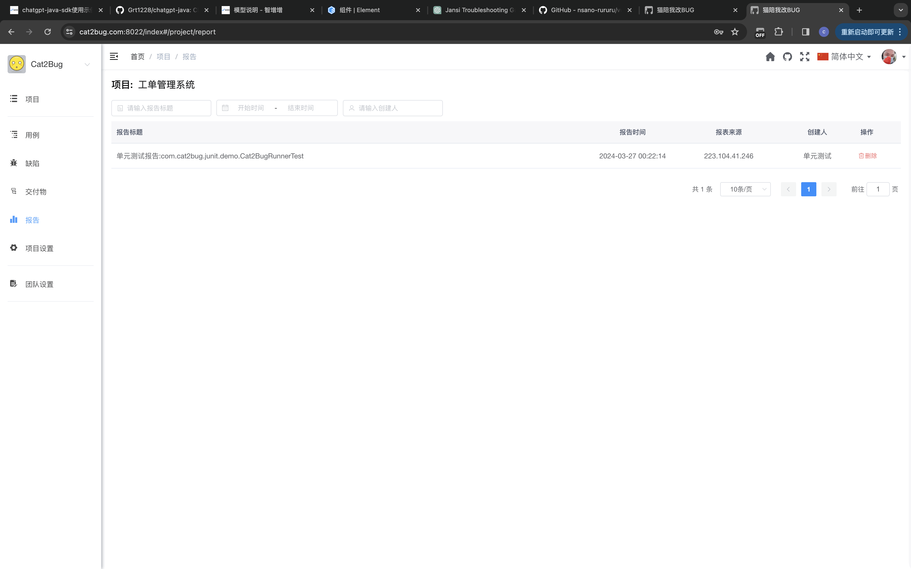

# 报告列表

报告列表展示了项目中已生成的所有测试报告，可以查看、导出和管理报告。

## 使用场景

- 查看历史测试报告
- 对比不同版本的测试结果
- 导出报告用于汇报
- 管理报告文档

## 列表展示

报告列表以表格形式展示所有报告信息。

### 列表信息

每个报告显示以下信息：

- **报告名称** - 报告的标题
- **报告类型** - 功能测试、性能测试、安全测试等
- **创建时间** - 报告生成时间
- **创建人** - 报告创建者
- **测试时间** - 测试起止时间
- **操作按钮** - 查看、导出、删除等操作

## 筛选功能

通过筛选条件快速找到需要的报告。

### 按时间筛选

- **今天** - 今天创建的报告
- **本周** - 本周创建的报告
- **本月** - 本月创建的报告
- **自定义时间** - 指定时间范围

### 按类型筛选

- **功能测试报告** - 功能测试相关报告
- **性能测试报告** - 性能测试相关报告
- **安全测试报告** - 安全测试相关报告
- **验收测试报告** - 验收测试相关报告
- **其他报告** - 其他类型报告

### 按创建人筛选

选择创建人，查看指定成员创建的报告。

## 搜索功能

在搜索框中输入关键字，快速搜索报告。

**搜索范围：**
- 报告名称
- 报告内容

**搜索特点：**
- 支持模糊匹配
- 实时搜索
- 高亮显示匹配内容

## 排序功能

点击列表表头，可以按不同字段排序。

**支持的排序字段：**
- **创建时间** - 按报告创建时间排序
- **更新时间** - 按报告更新时间排序
- **报告名称** - 按报告名称字母顺序排序

**排序方式：**
- **升序** - 从小到大、从旧到新
- **降序** - 从大到小、从新到旧

## 批量操作

选中多个报告，进行批量操作。

### 批量导出

1. 勾选要导出的多个报告
2. 点击【批量导出】按钮
3. 选择导出格式（PDF / Word）
4. 系统生成压缩包
5. 下载压缩包

### 批量删除

1. 勾选要删除的多个报告
2. 点击【批量删除】按钮
3. 确认删除操作
4. 系统删除选中的报告

## 快速操作

### 快速查看

点击报告名称，快速打开报告详情页面。

### 快速导出

点击报告右侧的【导出】按钮，快速导出单个报告。

### 快速删除

点击报告右侧的【删除】按钮，快速删除单个报告。

## 报告统计

列表顶部显示报告的统计信息：

- **报告总数** - 项目中的报告总数
- **本周新增** - 本周新增的报告数量
- **本月新增** - 本月新增的报告数量

::: tip 提示
1. 报告列表默认按创建时间倒序排列
2. 筛选和搜索可以组合使用
3. 批量操作前请确认选中的报告
4. 删除报告不可恢复，请谨慎操作
5. 建议定期归档历史报告，保持列表清爽
:::
