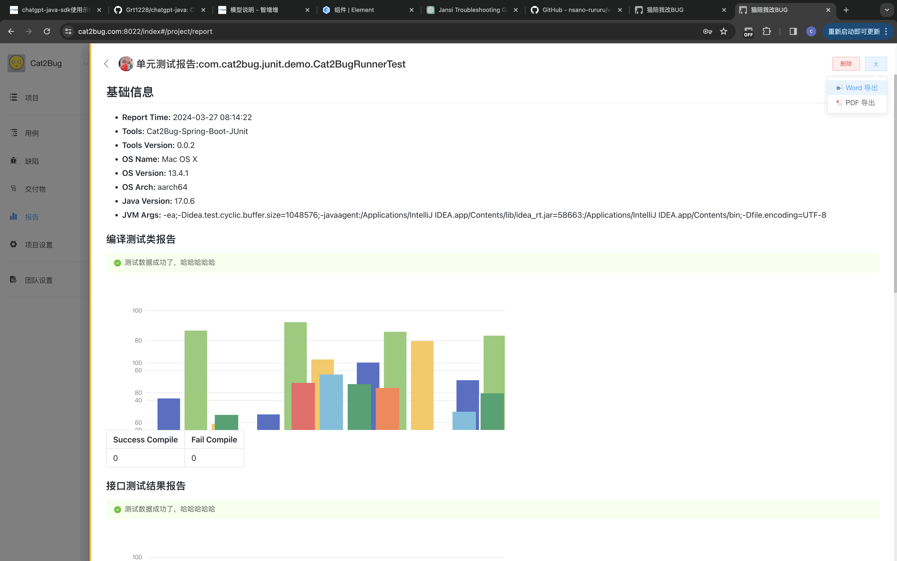

# 查看报告

查看测试报告的详细内容，了解测试执行情况和质量状况。

## 使用场景

- 查看测试执行结果
- 了解缺陷分布情况
- 评估项目质量
- 准备项目汇报
- 制定改进计划

## 打开报告

### 从报告列表打开

在报告列表中点击报告名称或【查看】按钮，打开报告详情页面。

### 从通知打开

收到报告生成通知后，点击通知中的链接直接打开报告。

## 报告内容

报告以 Markdown 格式展示，支持丰富的内容格式。



### 1. 测试概述

报告开头展示测试的基本信息：

- **测试目标** - 本次测试的目的和范围
- **测试范围** - 测试覆盖的功能模块
- **测试时间** - 测试的起止时间
- **测试人员** - 参与测试的成员
- **测试环境** - 测试使用的环境配置

### 2. 测试执行情况

展示测试用例的执行统计：

**用例统计：**
- 测试用例总数
- 已执行用例数
- 通过用例数
- 失败用例数
- 阻塞用例数

**执行率和通过率：**
```
用例执行率 = (已执行用例数 / 用例总数) × 100%
用例通过率 = (通过用例数 / 已执行用例数) × 100%
```

**图表展示：**
- 饼图展示用例执行结果分布
- 柱状图展示各模块用例执行情况
- 趋势图展示执行进度变化

### 3. 缺陷统计

展示缺陷的详细统计数据：

**缺陷总览：**
- 缺陷总数
- 新增缺陷数
- 已修复缺陷数
- 遗留缺陷数

**各状态缺陷分布：**
- 处理中 - 开发正在修复
- 待验证 - 等待测试验证
- 已驳回 - 验证未通过
- 已关闭 - 验证通过

**各优先级缺陷分布：**
- 急 - 系统崩溃、数据丢失、安全漏洞
- 高 - 核心功能无法使用
- 中 - 一般功能问题
- 低 - 界面优化、文案错误

**各类型缺陷分布：**
- 功能缺陷 - 功能实现错误
- UI 缺陷 - 界面显示问题
- 性能缺陷 - 性能不达标
- 安全缺陷 - 安全漏洞

**图表展示：**
- 饼图展示缺陷状态分布
- 柱状图展示缺陷优先级分布
- 热力图展示缺陷集中模块

### 4. 模块质量分析

分析各交付物的质量状况：

**各交付物统计：**
- 交付物名称
- 用例数量
- 缺陷数量
- 缺陷密度
- 质量评级

**高风险模块识别：**
- 缺陷密度高的模块
- 高优先级缺陷集中的模块
- 用例覆盖不足的模块

**质量趋势分析：**
- 缺陷数量变化趋势
- 缺陷修复速度趋势
- 质量改善趋势

### 5. 测试结论

给出明确的测试结论和建议：

**测试完成情况：**
- 测试是否按计划完成
- 测试覆盖是否充分
- 测试深度是否足够

**质量评估：**
- 整体质量等级（优秀/良好/一般/较差）
- 核心功能质量评估
- 非核心功能质量评估

**遗留问题：**
- 未修复的缺陷清单
- 未执行的用例清单
- 未覆盖的功能清单

**发布建议：**
- 是否建议发布
- 发布前需要解决的问题
- 发布后需要关注的风险

**风险提示：**
- 高优先级缺陷风险
- 功能不完整风险
- 性能问题风险
- 安全隐患风险

### 6. 改进建议

提出测试过程和产品质量的改进建议：

**测试过程改进：**
- 测试流程优化建议
- 测试效率提升建议
- 测试工具改进建议

**产品质量改进：**
- 代码质量改进建议
- 架构优化建议
- 性能优化建议

**团队协作改进：**
- 沟通机制改进建议
- 协作流程优化建议
- 知识分享建议

## 报告导航

### 目录导航

报告左侧显示目录，点击目录项可以快速跳转到对应章节。

### 锚点链接

报告中的章节标题自动生成锚点，可以通过 URL 直接定位到指定章节。

### 返回顶部

点击页面右下角的【返回顶部】按钮，快速回到报告开头。

## 报告交互

### 图表交互

报告中的图表支持交互操作：

- **悬停显示** - 鼠标悬停显示详细数据
- **点击筛选** - 点击图例筛选数据
- **缩放查看** - 支持图表缩放
- **导出图片** - 导出图表为图片

### 数据链接

报告中的数据支持点击跳转：

- 点击用例数量，跳转到用例列表
- 点击缺陷数量，跳转到缺陷列表
- 点击交付物名称，跳转到交付物详情

### 评论功能

可以对报告添加评论和讨论：

1. 在报告底部找到评论区
2. 输入评论内容
3. 点击【发表】按钮
4. 评论会显示在报告下方

## 报告分享

### 分享链接

点击【分享】按钮，复制报告链接，分享给团队成员。

**链接特点：**
- 项目成员可以直接访问
- 外部人员需要登录后访问
- 链接永久有效

### 导出分享

将报告导出为 PDF 或 Word 格式，通过邮件或其他方式分享。

::: tip 提示
1. 报告内容支持 Markdown 格式，排版清晰美观
2. 图表数据来源于实际测试数据，真实可靠
3. 点击报告中的数据可以跳转到详细列表
4. 建议结合项目实际情况理解报告结论
5. 报告评论可以用于讨论和补充说明
:::
