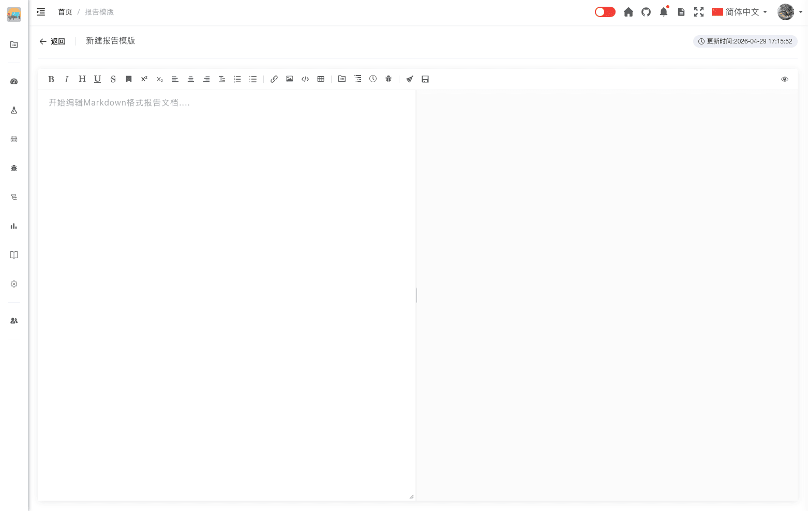
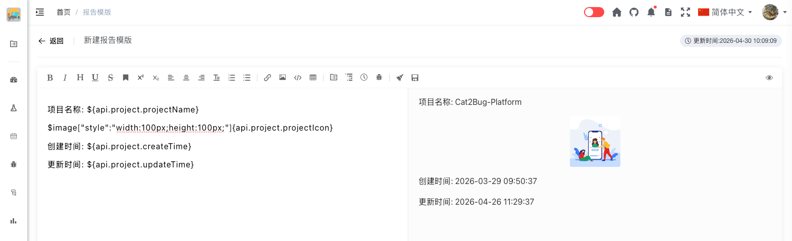
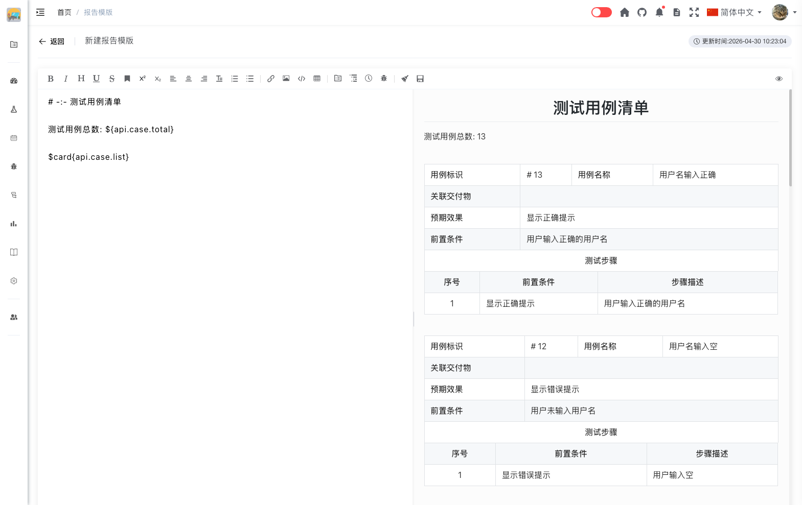
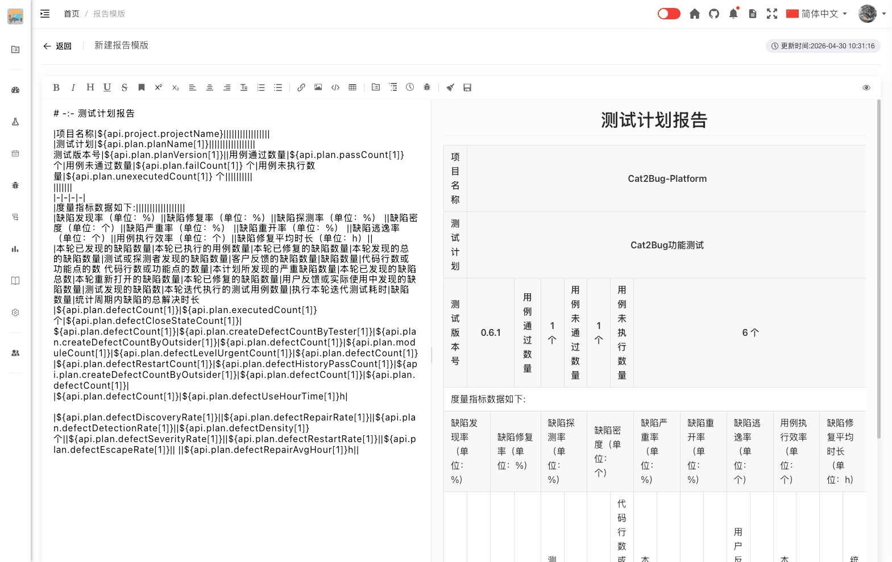
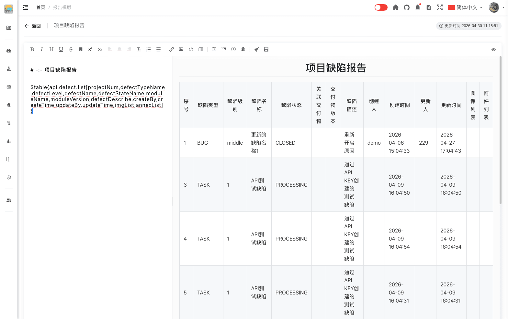

# 添加模版

添加报告模版，用于快速生成标准化的测试报告。

## 使用场景

- 创建项目专属的报告模版
- 定制不同类型的测试报告格式
- 建立团队统一的报告规范
- 复用常用的报告结构

## 什么是报告模版

报告模版是预先定义好的报告格式和内容结构，使用 Markdown 格式编写。通过模版可以快速生成格式统一、内容规范的测试报告。

**模版的作用：**

- 统一报告格式和风格
- 提高报告编写效率
- 确保报告内容完整
- 便于团队协作

## 页面介绍

### 模版列表页面

在报告管理页面，点击「生成报告」按钮，下拉显示模版列表页面。


模版以卡片形式展示，每个卡片包含：
- **模版缩略图** - 模版内容的预览图
- **模版标题** - 模版的名称

点击「添加模版」按钮可创建新的空白模版。

### 模版编辑页面

点击「添加模版」按钮后，系统会：
- 自动创建一个空白模版
- 模版标题默认为"新建报告模版"
- 自动跳转到模版编辑页面
- 页面打开后，光标默认落在左侧 Markdown 编辑区，可直接输入内容



模版编辑页面分为三个主要区域：

**标题栏：**
- 左侧：返回按钮、模版标题输入框（可实时修改）
- 右侧：更新时间显示

**编辑预览区域：**
- 左侧：编辑区域（Markdown 格式编写）
- 右侧：预览区域（实时预览渲染效果）

**工具栏：**
- 位于编辑区域上方
- 提供基础 Markdown 功能和系统专有功能

## 操作步骤

### 1. 进入模版管理

在报告管理页面，点击「生成报告」按钮，下拉显示模版列表页面。

### 2. 添加空白模版

点击「添加模版」按钮跳转到新建报告模版页面。

### 3. 修改模版标题

在页面顶部的标题输入框中，修改模版标题。

**命名建议：**
- 使用清晰的名称
- 说明模版用途

**示例：**
- ✅ 功能测试报告模版
- ✅ 性能测试报告模版
- ✅ 验收测试报告模版
- ❌ 模版1
- ❌ test

### 4. 编辑模版内容

在左侧编辑区域使用 Markdown 格式编写模版内容。

**编辑方式：**
1. 直接输入 Markdown 语法
2. 使用工具栏快速插入元素
3. 插入系统专有数据

**模版内容建议：**

```markdown
# 测试报告

## 1. 项目信息
<!-- 插入项目名称 -->
<!-- 插入项目描述 -->
<!-- 插入创建时间 -->

## 2. 测试概述
- 测试目标：[填写测试目标]
- 测试范围：[填写测试范围]
- 测试时间：[填写测试起止时间]
- 测试人员：[填写参与测试的成员]
- 测试环境：[填写测试环境]

## 3. 测试执行情况
<!-- 插入测试用例总数 -->
<!-- 插入测试计划统计表 -->

## 4. 缺陷统计
<!-- 插入缺陷总数 -->
<!-- 插入缺陷状态统计 -->
<!-- 插入缺陷等级统计 -->

## 5. 质量指标
<!-- 插入缺陷修复率 -->
<!-- 插入缺陷密度 -->
<!-- 插入缺陷严重率 -->

## 6. 测试结论
- 测试完成情况：[填写完成情况]
- 质量评估：[填写质量评估]
- 遗留问题：[列出遗留问题]
- 发布建议：[给出发布建议]

## 7. 附录
<!-- 插入缺陷表格 -->
```

### 5. 自动保存

模版内容会自动保存，无需手动保存。

**自动保存机制：**
- 标题修改后 500 毫秒自动保存
- 内容修改后 5 秒自动保存
- 保存时自动生成模版缩略图
- 显示最后更新时间

**手动保存：**
- 点击工具栏的「保存」按钮可手动保存
- 建议在重要修改后手动保存一次

### 6. 返回上一页

- 点击标题栏左侧**返回**按钮，或按 **Esc**，可返回报告模版列表。
- 若标题或内容尚未完成自动保存，系统会先立即保存，再返回上一页，不弹出确认对话框。

## 工具栏功能

编辑区域上方提供丰富的工具栏，分为基础 Markdown 功能和系统专有功能。

### 基础 Markdown 功能

#### 文本格式

- **粗体** - 加粗文本
- **斜体** - 倾斜文本
- **下划线** - 添加下划线
- **中划线** - 添加删除线
- **标记** - 高亮标记文本
- **上角标** - 添加上标
- **下角标** - 添加下标

#### 标题

- **一级标题** - 最大标题
- **二级标题** - 次级标题
- **三级标题** - 三级标题
- **四级标题** - 四级标题
- **五级标题** - 五级标题

#### 对齐方式

- **居左** - 文本左对齐
- **居中** - 文本居中对齐
- **居右** - 文本右对齐

#### 列表

- **有序列表** - 数字编号列表
- **无序列表** - 符号列表
- **段落** - 插入段落

#### 插入元素

- **链接** - 插入超链接
- **图片** - 插入图片
- **代码** - 插入代码块
- **表格** - 插入表格

### 系统专有功能

系统提供了与项目数据关联的特殊功能，可以自动获取项目数据并插入到报告中。

#### 项目信息

插入当前项目的基本信息：

- **项目名称** - 自动获取项目名称
- **项目封面** - 插入项目封面图片
- **创建时间** - 项目创建时间
- **更新时间** - 项目最后更新时间
- **描述** - 项目描述信息

**使用场景：**
- 报告开头展示项目基本信息
- 标识报告所属项目



::: tip 提示

其中项目封面中可以通过width和height自定义图片尺寸，示例如下：

$image["style":"width:200px;height:200px;"]{api.project.projectIcon}

:::

#### 测试用例

插入测试用例相关数据：

- **测试用例总数** - 项目中的用例总数
- **用例卡片** - 展示用例详细信息卡片

**使用场景：**
- 统计测试用例覆盖情况
- 展示用例执行概况



#### 测试计划

插入测试计划相关数据：

**测试计划统计表** - 所有测试计划的统计表格

**测试计划** - 单个测试计划的详细信息，包含以下子功能：
- **测试计划名称** - 测试计划的名称
- **测试版本** - 测试的版本号
- **测试未通过数量** - 未通过的用例数
- **测试通过数量** - 通过的用例数
- **测试未执行数量** - 未执行的用例数
- **测试已执行数量** - 已执行的用例数
- **测试用例总数量** - 测试用例总数

**缺陷** - 缺陷相关统计，包含以下子功能：
- **缺陷总数** - 项目中的缺陷总数
- **成员** - 成员相关统计
  - 测试人员发现的缺陷数量
  - 外部人员发现的缺陷数量
- **缺陷状态** - 缺陷状态统计
  - 处理中的数量
  - 待验证的数量
  - 已驳回的数量
  - 已关闭的数量
  - 曾经关闭过的缺陷数量
- **缺陷等级数量** - 各等级缺陷数量
  - 严重级别数量
  - 高等级数量
  - 中等级数量
  - 低等级数量
- **缺陷重启次数** - 缺陷被重新打开的次数
- **缺陷解决时长** - 缺陷从创建到关闭的平均时长
- **缺陷发现率** - 测试发现缺陷的效率
- **缺陷修复率** - 缺陷修复的比例
- **缺陷密度** - 每千行代码的缺陷数量
- **缺陷探测率** - 测试阶段发现的缺陷占比
- **缺陷严重率** - 严重缺陷占总缺陷的比例
- **缺陷重开率** - 缺陷被重新打开的比例
- **缺陷逃逸率** - 生产环境发现的缺陷占比
- **缺陷修复平均时长** - 缺陷修复的平均耗时

**交付物数量** - 项目中的交付物总数

**使用场景：**
- 展示测试计划执行情况
- 对比不同版本的测试结果
- 分析测试计划的质量指标



#### 缺陷

插入缺陷相关数据。

**缺陷表格** - 插入缺陷列表表格，展示所有缺陷的详细信息

**使用场景：**
- 附录中列出所有缺陷
- 提供缺陷详细清单



::: tip 提示

缺陷列表中，可以自己配置显示的字段，如下：

$table{api.defect.list[字段名]}

字段名解说：

- **projectNum** - 项目编号
- **defectTypeName** - 缺陷类型名称
- **defectLevel** - 缺陷等级
- **defectName** - 缺陷名称
- **defectStateName** - 缺陷状态名称
- **moduleName** - 交付物名称
- **moduleVersion** - 交付物版本
- **defectDescribe** - 缺陷描述
- **createBy** - 创建人
- **createTime** - 创建时间
- **updateBy** - 更新人
- **updateTime** - 更新时间
- **imgList** - 图片列表
- **annexList** - 附件列表

:::

### 其他功能按钮

#### 清除

清除文档全部内容。

**注意事项：**
- 操作前会弹出确认对话框
- 清除后无法恢复，请谨慎使用
- 建议在清除前先保存备份

#### 保存

手动触发保存操作。

**使用建议：**
- 虽然系统会自动保存，但可以手动保存确保数据安全
- 建议在重要修改后手动保存一次
- 保存后会更新右上角的更新时间

## 模版使用

创建好的模版可以在生成报告时使用：

1. 在报告管理页面点击「生成报告」
2. 选择要使用的模版
3. 系统会基于模版生成报告
4. 可以在生成的报告中继续编辑

## 模版管理

### 修改模版

1. 点击模版卡片进入编辑页面
2. 修改模版标题或内容
3. 系统自动保存修改

### 复制模版

1. 在模版列表中找到要复制的模版
2. 点击模版卡片右上角的「复制」按钮
3. 系统会创建一个新的模版副本
4. 可以修改副本的标题和内容

### 删除模版

目前暂不支持删除模版功能。

## 最佳实践

### 模版设计建议

1. **结构清晰**
   - 使用标题层级组织内容
   - 每个章节职责明确
   - 保持逻辑连贯

2. **内容完整**
   - 包含所有必要章节
   - 预留数据填写位置
   - 添加填写说明

3. **格式统一**
   - 使用统一的标题格式
   - 保持列表格式一致
   - 表格结构规范

4. **易于使用**
   - 添加填写提示
   - 提供示例内容
   - 说明注意事项

### 模版内容建议

1. **使用占位符**
   ```markdown
   - 测试时间：[填写测试起止时间]
   - 测试人员：[填写参与测试的成员]
   ```

2. **添加表格模板**
   ```markdown
   | 用例状态 | 数量 | 占比 |
   |---------|------|------|
   | 通过    |      |      |
   | 失败    |      |      |
   | 阻塞    |      |      |
   ```

3. **提供示例内容**
   ```markdown
   ## 测试结论
   
   根据本次测试结果，系统整体质量[优秀/良好/一般/较差]，
   [建议/不建议]发布到生产环境。
   
   主要风险：
   1. [描述主要风险]
   2. [描述主要风险]
   ```

## 常见问题

### Q: 模版内容会自动保存吗？

A: 是的。标题修改后 500 毫秒自动保存，内容修改后 5 秒自动保存。

### Q: 可以创建多少个模版？

A: 没有数量限制，可以根据需要创建多个模版。

### Q: 模版可以导入导出吗？

A: 目前不支持模版的导入导出功能，但是可以通过粘贴复制的方式拷贝模版中的 Markdown 文档。

::: tip 提示
1. 模版内容使用 Markdown 格式编写
2. 模版会自动保存，无需手动保存
3. 模版缩略图会自动生成
4. 建议为不同类型的测试创建专门的模版
5. 模版可以包含图表、表格等丰富内容
:::
