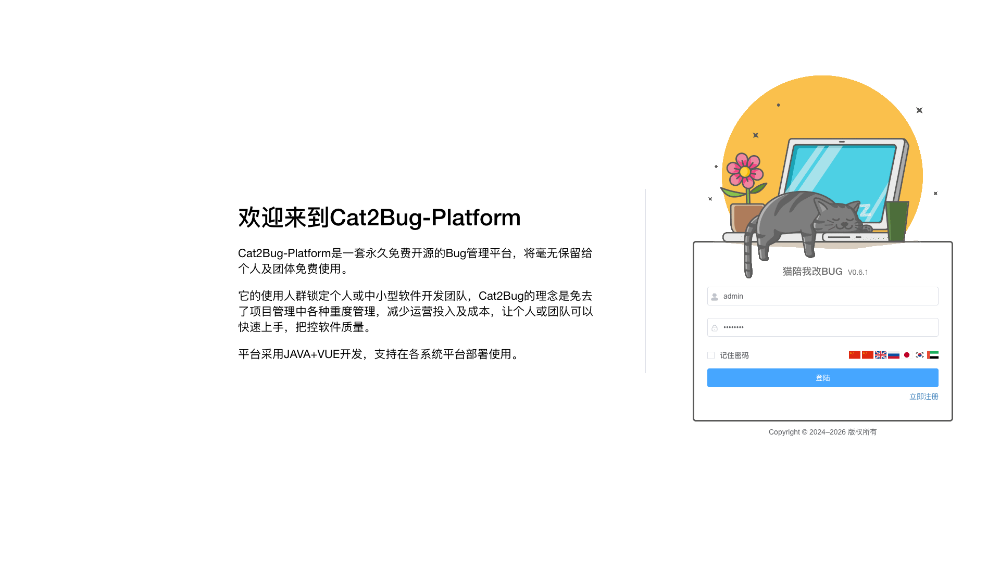

# 组织和成员 [/team/setting](/team/setting)

## 概述

组织和成员是团队管理员用于管理团队人员的模块。通过成员管理，可以添加、移除团队成员，分配角色和权限，确保团队的有效协作。

## 功能说明

### 成员管理

管理团队成员及其权限。

**功能：**
- 查看团队成员列表
- 添加新成员
- 移除成员
- 分配成员角色
- 设置成员权限

**操作步骤：**

#### 添加成员
1. 点击"成员管理"
2. 点击"添加成员"按钮
3. 输入成员邮箱或用户名
4. 选择成员角色（团队管理员、项目经理、开发、测试等）
5. 点击"确定"完成添加
6. 系统会向新成员发送邀请通知

#### 修改成员角色
1. 在成员列表中找到目标成员
2. 点击"编辑"按钮
3. 修改成员角色
4. 点击"保存"

#### 移除成员
1. 在成员列表中找到目标成员
2. 点击"移除"按钮
3. 确认移除操作

> **注意**：移除成员后，该成员将无法访问团队下的所有项目，但其创建的数据（缺陷、用例等）会保留。

## 成员角色说明

### 团队管理员
- 拥有团队的所有权限
- 可以管理团队设置
- 可以添加/移除成员
- 可以创建和管理项目
- 可以分配角色和权限

### 项目经理
- 可以创建和管理项目
- 可以管理项目成员
- 可以查看团队所有项目
- 可以分配项目任务

### 开发人员
- 可以查看和处理缺陷
- 可以查看测试用例
- 可以上传交付物
- 可以查看项目报告

### 测试人员
- 可以创建和管理测试用例
- 可以创建和管理缺陷
- 可以执行测试计划
- 可以查看项目报告

### 观察者
- 只能查看团队和项目信息
- 不能创建或修改数据
- 适合项目干系人、客户等

## 成员列表信息

成员列表显示以下信息：
- **姓名**：成员的真实姓名
- **用户名**：成员的登录账号
- **邮箱**：成员的电子邮箱
- **角色**：成员在团队中的角色
- **加入时间**：成员加入团队的日期
- **最后活跃**：成员最后一次访问团队的时间

## 权限说明

只有团队管理员才能管理团队成员。

## 常见问题

**Q: 如何邀请新成员加入团队？**  
A: 在"成员管理"中点击"添加成员"，输入成员邮箱或用户名，系统会发送邀请通知。

**Q: 成员必须先注册系统账号吗？**  
A: 是的。成员需要先在系统中注册账号，才能被添加到团队中。

**Q: 一个成员可以有多个角色吗？**  
A: 可以。系统支持为成员分配多个角色，成员将拥有所有角色的权限。

**Q: 移除成员后，其创建的数据会被删除吗？**  
A: 不会。移除成员只是取消其访问权限，其创建的缺陷、用例等数据会保留。

**Q: 如何查看成员的活跃度？**  
A: 在成员列表中可以看到"最后活跃"时间，显示成员最后一次访问团队的时间。

**Q: 团队管理员可以被移除吗？**  
A: 可以，但团队至少需要保留一个团队管理员。如果只有一个管理员，需要先添加新的管理员才能移除。

**Q: 成员离职后如何处理？**  
A: 建议先将其负责的任务转交给其他成员，然后再从团队中移除该成员。

**Q: 团队成员和项目成员有什么区别？**  
A: 团队成员是团队级别的，可以访问团队下的多个项目；项目成员是项目级别的，只能访问特定项目。
