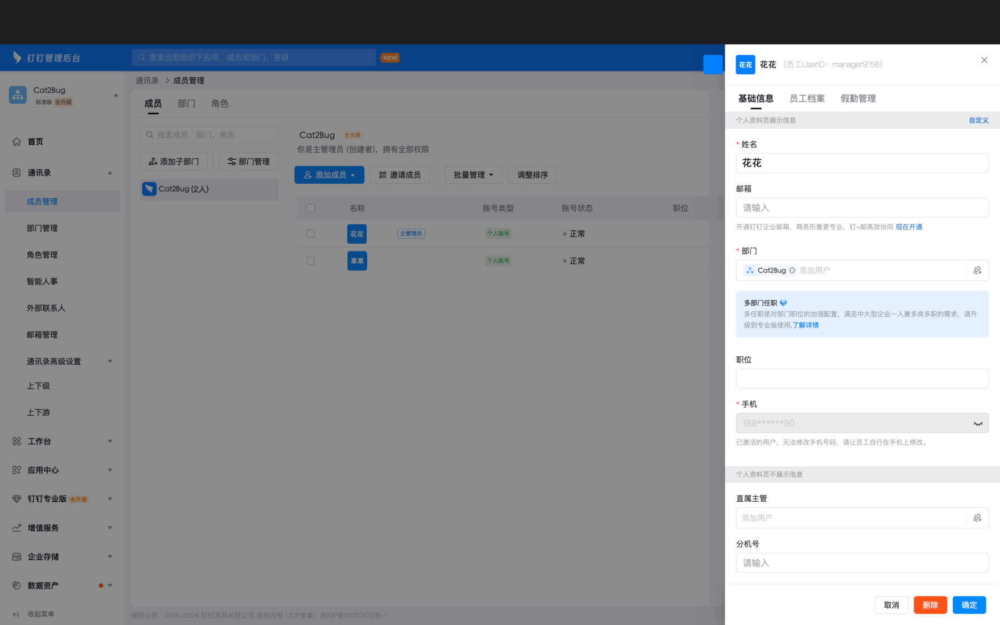
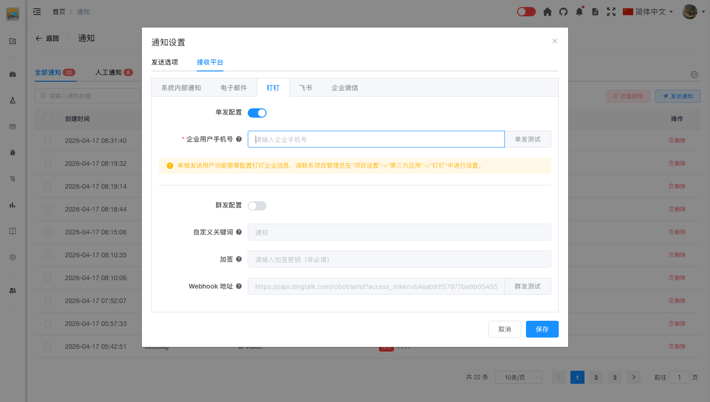
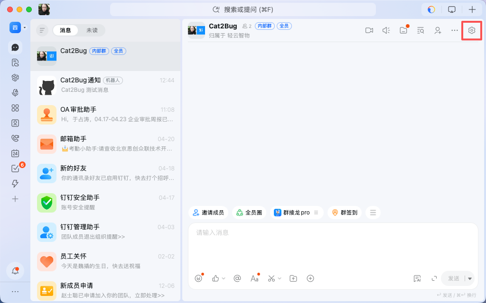
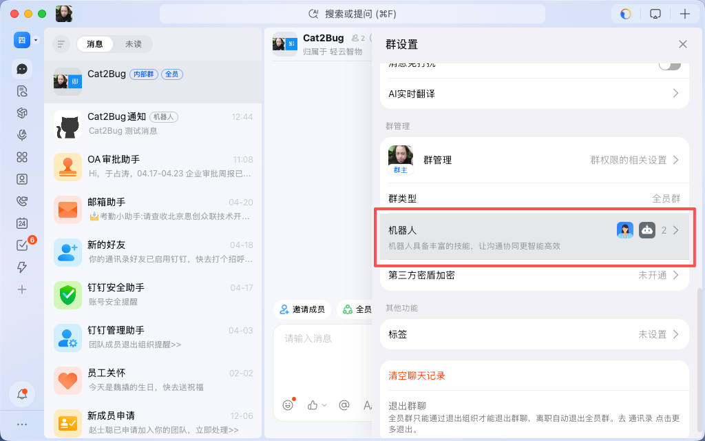
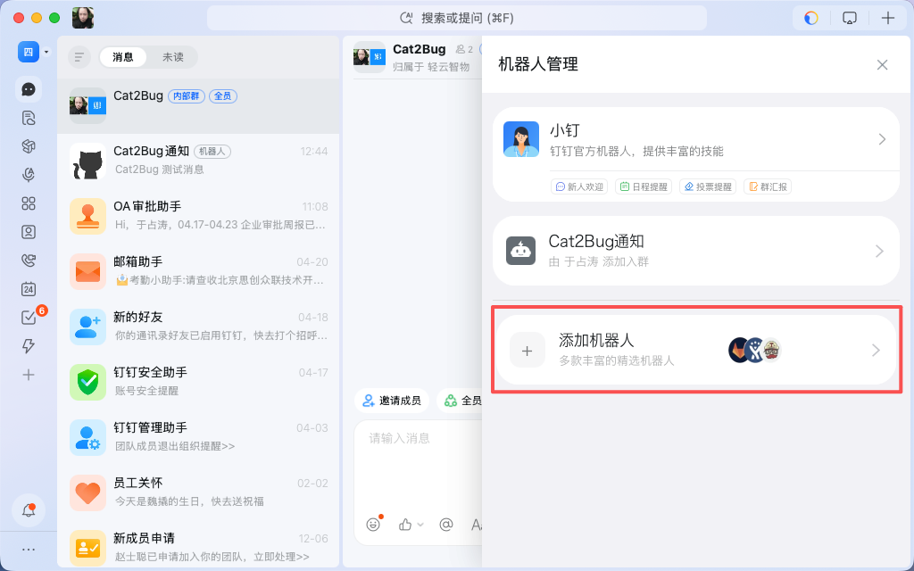
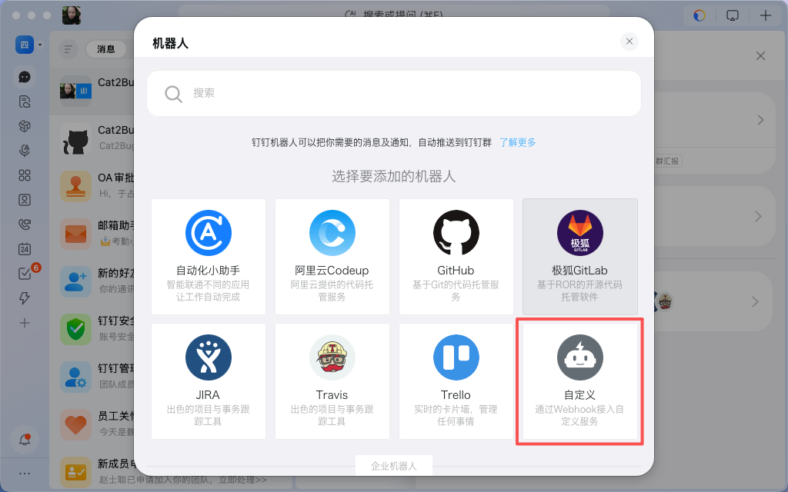
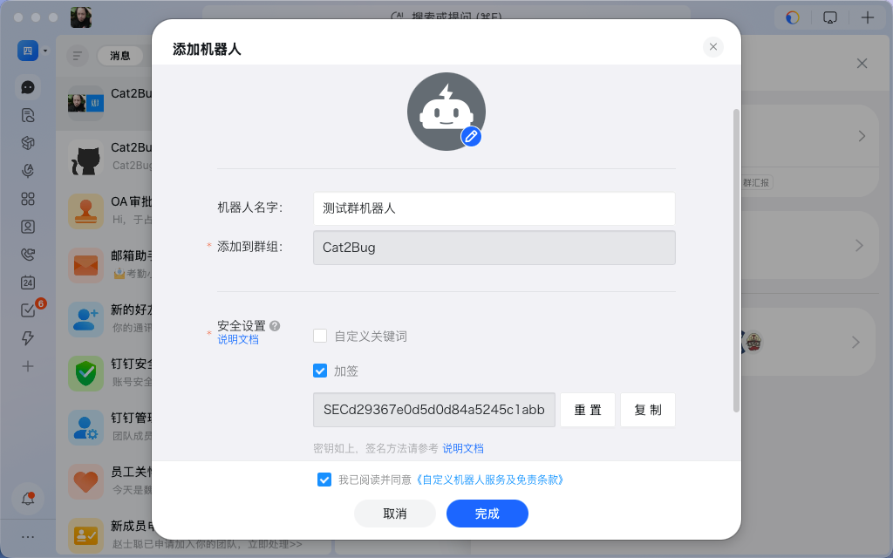
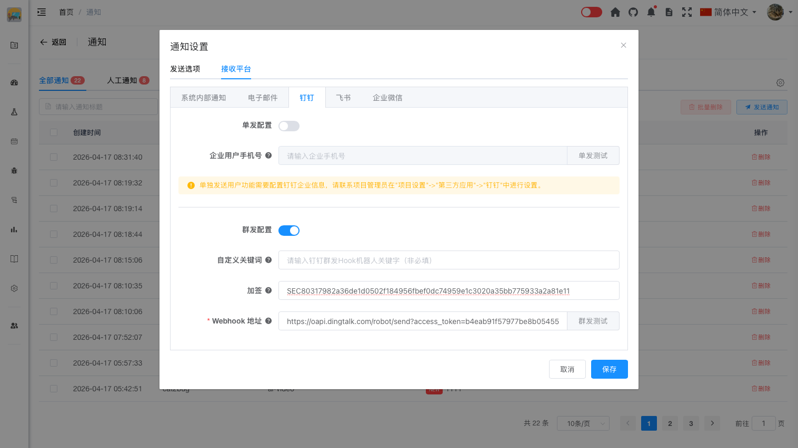

# 钉钉通知

## 概述

钉钉通知允许用户通过钉钉接收系统通知，支持企业个人推送和机器人群发两种方式。

## 企业个人推送

### 功能说明

- 将发送给当前用户的通知直接发送到个人钉钉账号
- 适合接收个人相关的通知
- 需要企业钉钉应用支持

### 前置条件

- 企业已开通钉钉企业应用
- 用户已加入企业钉钉组织且在企业用户中录入过手机号码
- 需要管理员在"项目设置"->"第三方应用"->"钉钉"中进行配置

### 用户配置步骤

如果需要将通知信息单独发送给指定成员，需要获取成员在钉钉企业内的手机号，并配置到Cat2Bug-Platform个人通知配置中。

1. 用管理员账号登陆钉钉OA平台 [https://oa.dingtalk.com](https://oa.dingtalk.com)

2. 进入指定企业组织后，选择【通讯录】->【成员管理】菜单，在右侧成员列表中点击需要查看的成员信息，在右侧弹出界面上侧，查看并复制手机号。

3. 进入Cat2Bug-Platform系统，点击右上角的通知图标，进入通知页面后选择右侧配置按钮，选择【接收平台】->【钉钉】页面，开启“单发配置”开关。

4. 将从钉钉平台中获取的手机号设置在【接收平台】->【钉钉】->【企业用户手机号】中并点击"保存"按钮。

5. 点击"单发测试"按钮，系统提示"测试消息发送成功"，并且在钉钉客户端可以收到机器人发来的测试消息，表示配置成功。

::: tip 提示

配置企业个人推送还需要项目管理员配置钉钉企业应用，详情请参考[用户指南->当前项目->项目设置->第三方应用->钉钉](../../current-project/project-setting/project-third-party/ding.md)

:::

## 机器人群发

### 功能说明

- 将发送给当前用户的通知发送到钉钉群组
- 适合团队协作场景
- 通过钉钉机器人向群组发送通知

### 前置条件

- 需要在钉钉群中添加自定义机器人
- 需要配置机器人的 Webhook 地址、自定义关键词、加签（自定义关键词和加签可二选一配置）

### 配置步骤

#### 创建钉钉客户端群组机器人

1. 打开钉钉客户端，点击群组右上角的设置按钮。

2. 选择机器人选项进入“机器人管理”页面。

3. 在“机器人管理”页面中，点击“添加机器人”选项。

4. 在弹出的选择机器人选项框中选择“自定义机器人”。

5. 在“自定义机器人”中输入机器人名称，勾选“加签”或“自定义关键词”（建议二选一即可），勾选“我已阅读并同意”选项后，点击“完成”按钮。

#### 用户配置

1. 在Cat2Bug-Platform系统中，点击右上角的通知图标，进入通知页面后选择右侧配置按钮，选择【接收平台】->【钉钉】配置页面，启动“群发配置”开关。

2. 将刚刚创建的机器人信息输入到配置项中，点击“保存”按钮。

3. 点击"群发测试"按钮，系统提示"测试消息发送成功"，并且在钉钉群组中可以收到Cat2Bug-Platform发来的测试消息，表示配置成功。

## 最佳实践

- 根据团队使用习惯选择钉钉通知方式
- 个人通知使用企业个人推送
- 团队协作使用机器人群发，确保团队成员都能收到

## 常见问题

**Q: 为什么收不到钉钉通知？**  
A: 请检查以下几点：
- 确认通知设置中已开启"钉钉"
- 如果是单人发送，检查项目管理员是否已在"项目设置"->"第三方应用"->"钉钉"中配置钉钉企业应用
- 确认您已加入企业钉钉组织
- 检查钉钉客户端的通知权限设置

**Q: 可以自定义钉钉通知的内容吗？**  
A: 钉钉通知的内容由系统自动生成，用户无法自定义。

**Q: 钉钉通知会有延迟吗？**  
A: 钉钉通知通常是实时推送的，但可能会因网络状况有轻微延迟。

**Q: 如何关闭钉钉通知？**  
A: 在通知设置的接收平台中，取消"单发配置"或"群发配置"即可。
