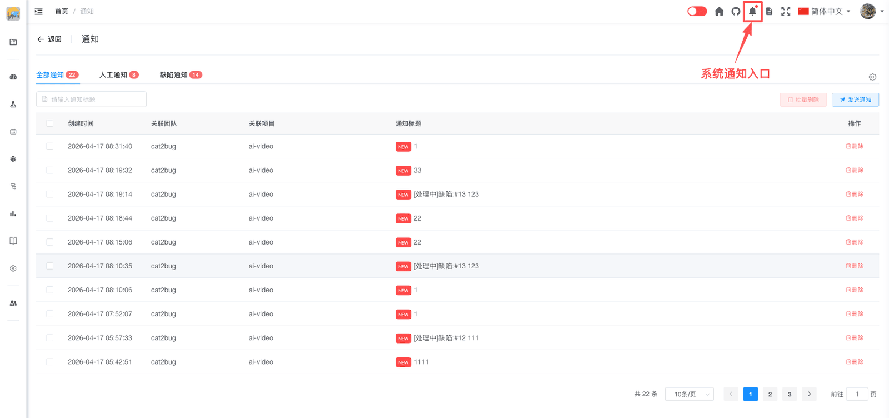

# 通知列表 [/notice/index](/notice/index)

## 功能概述

通知功能帮助用户及时接收项目相关的消息和系统通知。用户可以查看通知列表，并根据个人需求自定义通知设置。

## 访问通知

1. 点击顶部导航栏的通知图标
2. 或访问 `/notice/index` 页面

## 通知类型

通知列表会显示以下类型的消息：

- **人工通知**：项目级别的通知
  - 项目管理员发送的消息

- **缺陷通知**：指向自己的缺陷相关通知
  - 缺陷被分配给你
  - 缺陷状态变更

- **报告通知**：报告相关的通知
  - 项目生成新报告

## 通知操作

- 点击通知可查看详情
- 删除通知
- 批量删除

## 最佳实践

### 通知管理
- 定期查看和清理通知
- 及时标记已读通知
- 关注重要缺陷获取更新

## 键盘快捷键

通用说明见 [键盘快捷键](../../../advanced/keyboard-shortcuts.md)。

在通知列表页（无弹框/抽屉时）可用 **空格** 打开动作面板，或按住 **⌘/Ctrl** 查看工具栏徽标：

| 字母 | 动作 |
|------|------|
| S | 查询 |
| J | 切换 Tab |
| G | 打开通知设置 |
| E | 打开发送通知 |
| B | 上一页 |
| P | 下一页 |

弹框内快捷键见 [发送选项](send-options.md#键盘快捷键)。

## 常见问题

**Q: 为什么收不到通知？**  
A: 请检查通知设置是否正确配置，确认已勾选相应的通知类型和接收平台。

**Q: 通知会保留多久？**  
A: 系统通知会长期保留，您可以随时查看历史通知。

**Q: 如何只接收重要通知？**  
A: 在发送选项中只勾选"指派给我的"，取消其他选项，可以减少通知数量。
