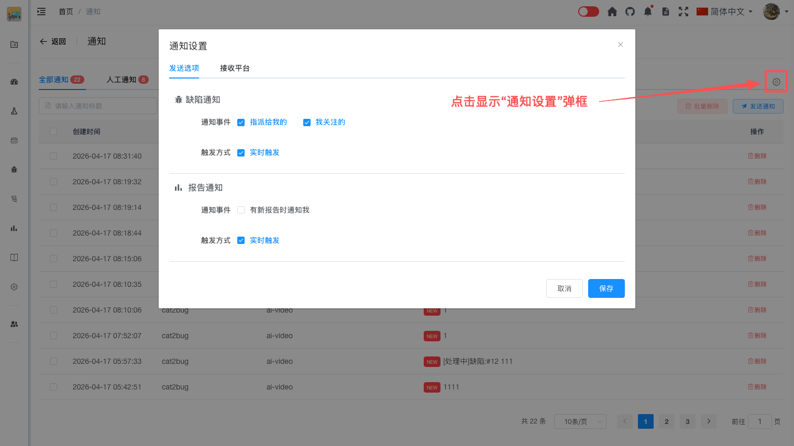

# 发送选项

## 概述

发送选项用于设置发送的通知类型和触发方式，确保只接收关心的信息。

## 缺陷通知

**通知事件：**
- 指派给我的：当缺陷被分配给你时接收通知
- 我关注的：当关注的缺陷有更新时接收通知

**触发方式：**
- 实时触发：事件发生时立即发送通知

## 报告通知

**通知事件：**
- 有新报告时通知我：当项目生成新报告时接收通知

**触发方式：**
- 实时触发：报告生成后立即发送通知

## 配置发送选项

### 打开通知设置

1. 访问通知页面 `/notice/index`
2. 点击通知列表右上侧的"通知设置"图标按钮
3. 进入通知设置对话框

### 配置步骤

1. 在"发送选项"标签页中
2. 选择要接收的通知类型：
   - 勾选"指派给我的"接收分配的缺陷通知
   - 勾选"我关注的"接收关注缺陷的更新
3. 选择触发方式：
   - 勾选"实时触发"立即接收通知
4. 配置报告通知选项
5. 点击"保存"按钮

## 最佳实践

- 根据工作需要选择通知类型
- 避免接收过多通知造成干扰
- 工作时间使用实时触发，非工作时间可以选择其他触发方式

## 常见问题

**Q: 如何关闭某类通知？**  
A: 在通知设置的发送选项中，取消勾选不想接收的通知类型。

**Q: 如何只接收重要通知？**  
A: 在发送选项中只勾选"指派给我的"，取消其他选项，可以减少通知数量。
