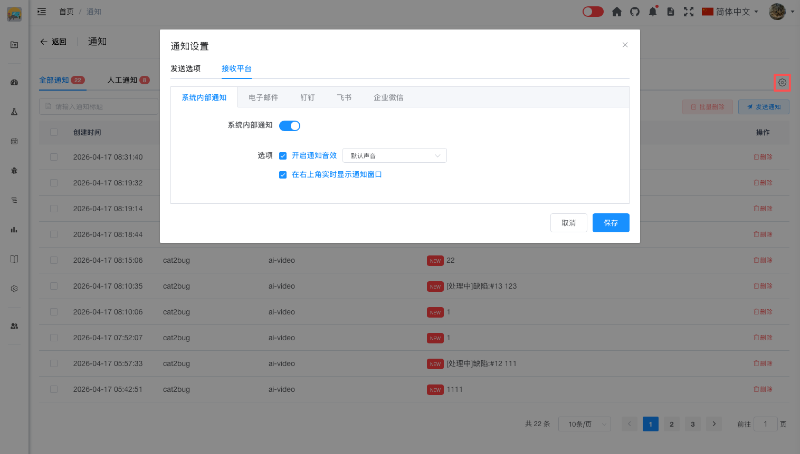

# 系统内部通知

## 概述

系统内部通知是 Cat2Bug 平台内置的通知方式，通过系统内部消息推送机制向用户发送通知。

## 功能特点

- **开关控制**：可以启用或关闭系统内部通知
- **通知音效**：支持开启或关闭通知提示音
- **音效选择**：可以选择不同的通知提示音
- **实时通知窗口**：支持在右上角实时显示通知窗口

## 配置项说明

### 开关

- 控制是否启用系统内部通知
- 关闭后将不再接收系统内部通知

### 开启通知音效

- 控制是否播放通知提示音
- 开启后，收到新通知时会播放提示音
- 关闭后，收到通知时不会有声音提示

### 音效选择

- 可以选择不同的通知提示音
- 系统提供多种音效供选择
- 根据个人喜好选择合适的提示音

### 在右上角实时显示通知窗口

- 控制是否在右上角弹出通知窗口
- 开启后，收到新通知时会在右上角显示通知内容
- 关闭后，通知只会在通知列表中显示，不会弹窗提示

## 启用系统内部通知

### 打开通知设置

1. 访问通知页面 `/notice/index`
2. 点击通知列表右上侧的"通知设置"图标按钮
3. 进入通知设置对话框

### 配置步骤

1. 切换到"接收平台"标签页
2. 勾选"系统内部通知"
3. 点击"保存"按钮

## 通知接收方式

启用系统内部通知后，您将通过以下方式接收通知：

- **通知图标**：顶部导航栏的通知图标会显示未读通知数量
- **通知列表**：访问 `/notice/index` 查看完整的通知列表
- **实时提醒**：新通知到达时会有实时提示

## 最佳实践

- 建议始终保持系统内部通知开启
- 系统内部通知可以与其他接收平台同时使用
- 定期查看通知列表，及时处理重要消息

## 常见问题

**Q: 系统内部通知需要配置吗？**  
A: 不需要，系统内部通知默认启用，无需额外配置。

**Q: 系统内部通知会保留多久？**  
A: 系统内部通知会长期保留，您可以随时查看历史通知。

**Q: 如何关闭系统内部通知？**  
A: 在通知设置的接收平台中，取消勾选"系统内部通知"即可。但不建议关闭，因为这是最基本的通知方式。

**Q: 系统内部通知会影响性能吗？**  
A: 不会，系统内部通知采用高效的推送机制，不会影响系统性能。

**Q: 可以只使用系统内部通知吗？**  
A: 可以，如果您不需要通过邮件或第三方平台接收通知，只启用系统内部通知即可。
