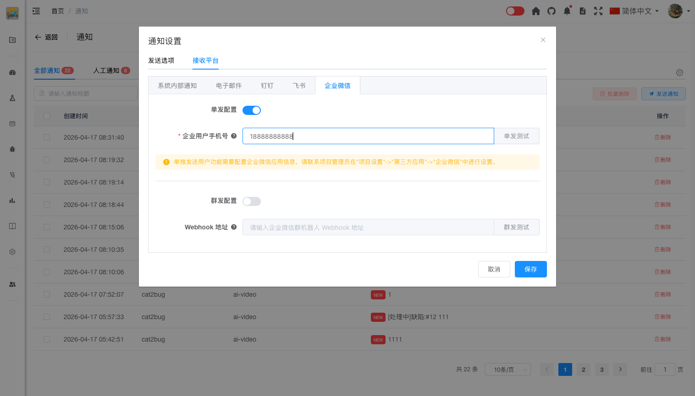
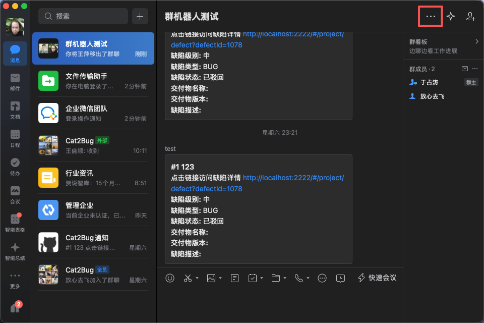
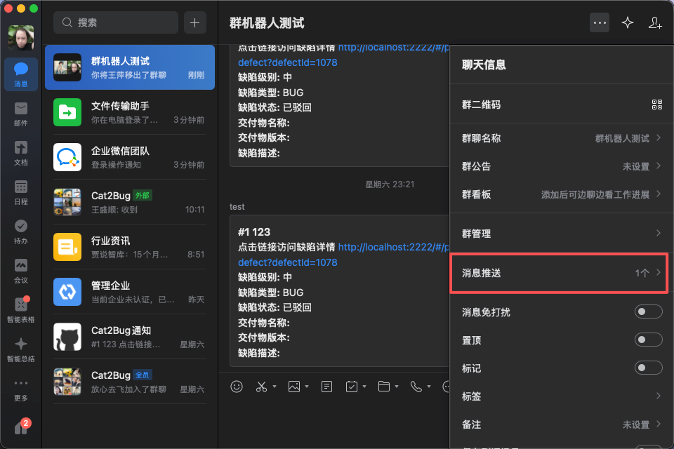
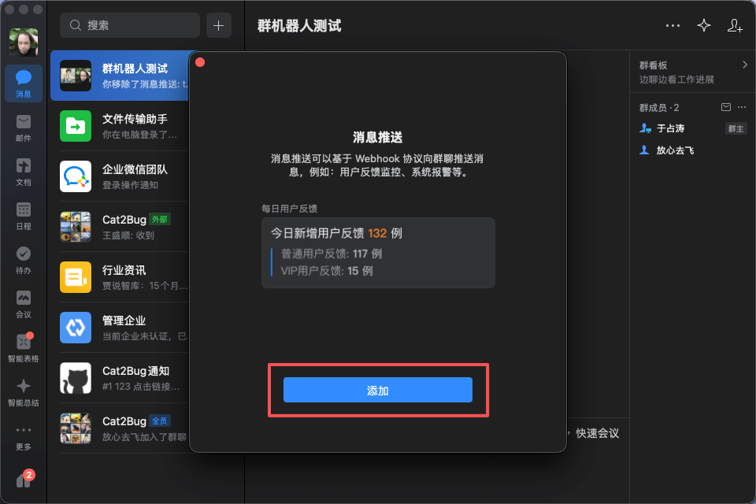
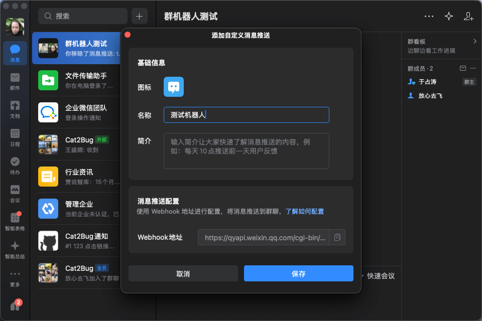
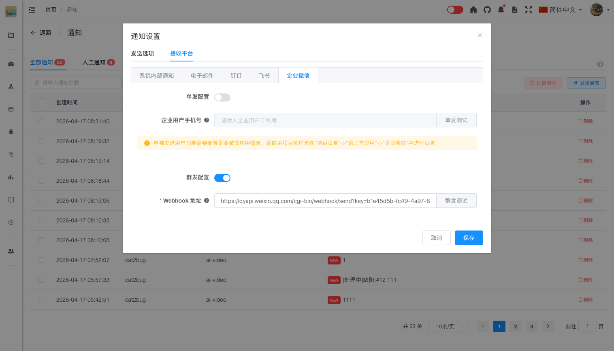

# 企业微信通知

## 概述

企业微信通知允许用户通过企业微信接收系统通知，支持企业个人推送和机器人群发两种方式。

## 企业个人推送

### 功能说明

- 将发送给当前用户的通知直接发送到个人企业微信账号
- 适合接收个人相关的通知
- 需要企业微信应用支持

### 前置条件

- 企业已开通企业微信应用
- 用户已加入企业微信组织
- 需要管理员在"项目设置"->"第三方应用"->"企业微信"中进行配置

### 用户配置步骤

如果需要将通知信息单独发送给指定成员，需要配置到Cat2Bug-Platform个人通知配置中。

1. 进入Cat2Bug-Platform系统，点击右上角的通知图标，进入通知页面后选择右侧配置按钮，选择【接收平台】->【企业微信】页面，开启"单发配置"开关。

2. 输入企业微信中的用户手机号，点击"保存"按钮。

3. 点击"单发测试"按钮，系统提示"测试消息发送成功"，并且在企业微信客户端可以收到Cat2Bug-Platform发来的测试消息，表示配置成功。

::: tip 提示

配置企业个人推送还需要项目管理员配置企业微信应用，详情请参考[用户指南->当前项目->项目设置->第三方应用->企业微信](../../current-project/project-setting/project-third-party/enterprise-wechat.md)

:::

## 机器人群发

### 功能说明

- 将发送给当前用户的通知发送到企业微信群组
- 适合团队协作场景
- 通过企业微信机器人向群组发送通知

### 前置条件

- 需要在企业微信群中添加自定义机器人
- 需要配置机器人的 Webhook 地址

### 配置步骤

#### 创建企业微信客户端群组机器人

1. 打开企业微信客户端，点击群组右上角的设置按钮。

2. 选择消息推送选项进入“消息推送”页面。

3. 在“消息推送”弹框中点击“添加”按钮。

4. 在“添加自定义消息推送”弹框中输入机器人名称后，备份Webhook地址后，点击“添加”按钮。

#### 用户配置

1. 在Cat2Bug-Platform系统中，点击右上角的通知图标，进入通知页面后选择右侧配置按钮，选择【接收平台】->【企业微信】配置页面，启动"群发配置"开关。

2. 将刚刚备份的Webhook输入到配置项中，点击"保存"按钮。

3. 点击"群发测试"按钮，系统提示"测试消息发送成功"，并且在企业微信群组中可以收到机器人发来的测试消息，表示配置成功。

## 最佳实践

- 根据团队使用习惯选择企业微信通知方式
- 个人通知使用企业个人推送
- 团队协作使用机器人群发，确保团队成员都能收到

## 常见问题

**Q: 为什么收不到企业微信通知？**  
A: 请检查以下几点：
- 确认通知设置中已开启"企业微信"
- 如果是单人发送，检查项目管理员是否已在"项目设置"->"第三方应用"->"企业微信"中配置企业微信应用
- 确认您已加入企业微信组织
- 检查企业微信客户端的通知权限设置

**Q: 可以自定义企业微信通知的内容吗？**  
A: 企业微信通知的内容由系统自动生成，用户无法自定义。

**Q: 企业微信通知会有延迟吗？**  
A: 企业微信通知通常是实时推送的，但可能会因网络状况有轻微延迟。

**Q: 如何关闭企业微信通知？**  
A: 在通知设置的接收平台中，取消"单发配置"或"群发配置"即可。
