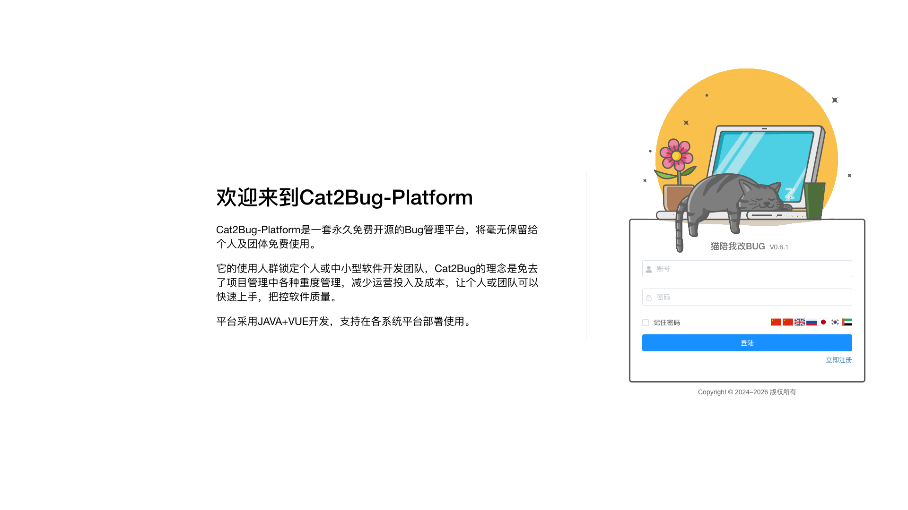

# 登录 [/login](/login)

## 概述

登录是用户访问系统的入口。通过登录功能，用户可以使用账号和密码进入系统，开始使用各项功能。

## 功能说明

### 登录表单

登录页面包含以下输入项：

- **账号**：用户的登录账号（用户名）
- **密码**：用户的登录密码
- **记住密码**：勾选后，下次访问时会自动填充账号信息

### 登录步骤

1. 在"账号"输入框中输入您的用户名
2. 在"密码"输入框中输入您的登录密码
3. 如需下次自动填充账号，勾选"记住密码"
4. 点击"登录"按钮

### 记住密码功能

勾选"记住密码"后：
- 系统会在本地保存您的账号信息
- 下次访问时会自动填充账号
- 密码不会被保存，仍需手动输入
- 仅在当前浏览器有效

> **安全提示**：在公共电脑上使用时，请不要勾选"记住密码"选项。

## 登录失败处理

### 常见登录失败原因

**账号或密码错误**
- 检查账号是否输入正确
- 检查密码大小写是否正确
- 确认是否开启了大写锁定键

**账号被禁用**
- 联系管理员确认账号状态
- 确认是否违反了使用规定

**网络连接问题**
- 检查网络连接是否正常
- 尝试刷新页面重新登录

### 忘记密码

如果忘记密码：
1. 联系系统管理员
2. 管理员可以为您重置密码
3. 使用新密码登录后，建议立即修改为自己的密码

## 安全建议

- 不要在公共场所使用"记住密码"功能
- 定期修改密码，建议每3个月更换一次
- 使用强密码，包含大小写字母、数字和特殊字符
- 不要与他人共享账号密码
- 离开电脑时及时退出登录

## 常见问题

**Q: 登录后多久会自动退出？**  
A: 系统会在一段时间无操作后自动退出，具体时间由管理员配置。

**Q: 可以同时在多个设备上登录吗？**  
A: 可以。系统支持同一账号在多个设备上同时登录。

**Q: 首次登录需要修改密码吗？**  
A: 如果是管理员创建的账号，建议首次登录后立即修改密码。
