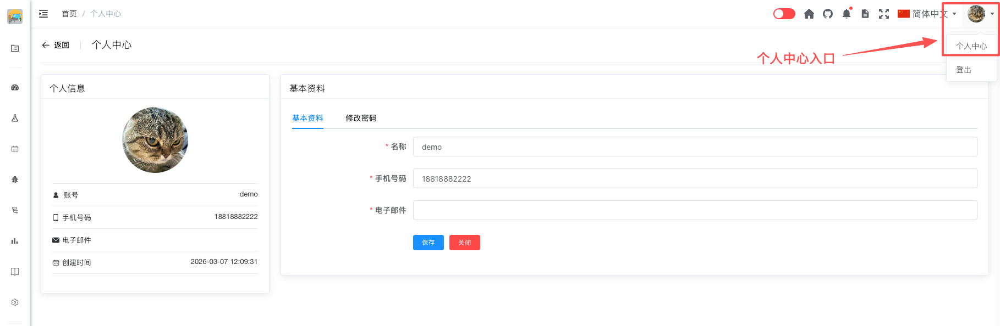

# 个人中心 [/member/profile](/member/profile)

## 概述

个人中心是用户管理个人信息和账号设置的地方。在这里，用户可以修改个人资料、更换头像、修改密码等。

## 功能说明

### 个人信息

个人信息区域位于页面左侧，显示用户的基本信息。

**显示内容：**
- 用户头像
- 用户名称
- 登录账号

#### 更换头像

点击头像可以更换用户头像。

**操作步骤：**
1. 点击左侧的头像区域
2. 选择本地图片文件
3. 裁剪图片（如需要）
4. 点击"确定"上传

**头像要求：**
- 支持格式：JPG、PNG、GIF
- 建议尺寸：200x200 像素
- 最大文件大小：2MB
- 建议使用清晰的正方形图片

### 基本信息

基本信息区域位于页面右侧上方，用于编辑用户的基本资料。

**可编辑内容：**
- **名称**：用户的显示名称
- **手机号**：用户的联系电话
- **电子邮件**：用户的邮箱地址

**操作步骤：**
1. 在对应输入框中修改信息
2. 点击"保存"按钮保存更改

**字段说明：**
- **名称**：会显示在团队成员列表、缺陷分配等位置
- **手机号**：用于接收系统通知，必须是有效的手机号格式
- **电子邮件**：用于接收邮件通知，必须是有效的邮箱格式

### 修改密码

修改密码模块位于页面右侧下方，用于更改登录密码。

**输入项：**
- **旧密码**：当前使用的密码
- **新密码**：要设置的新密码
- **确认密码**：再次输入新密码以确认

**操作步骤：**
1. 在"旧密码"输入框中输入当前密码
2. 在"新密码"输入框中输入新密码
3. 在"确认密码"输入框中再次输入新密码
4. 点击"保存"按钮完成修改

**密码要求：**
- 长度：至少6个字符
- 建议包含：大小写字母、数字、特殊字符
- 新密码不能与旧密码相同
- 两次输入的新密码必须一致

> **安全提示**：修改密码后，建议在其他已登录设备上重新登录。

## 修改失败处理

### 基本信息修改失败

**手机号格式错误**
- 检查手机号是否为11位数字
- 确认手机号格式是否正确

**邮箱格式错误**
- 检查邮箱格式是否正确
- 必须包含@符号和域名

**手机号或邮箱已被使用**
- 该手机号或邮箱已被其他用户绑定
- 请更换其他手机号或邮箱

### 密码修改失败

**旧密码错误**
- 检查输入的旧密码是否正确
- 注意大小写是否正确

**新密码不符合要求**
- 检查密码长度是否符合要求
- 确保密码包含必要的字符类型

**两次密码不一致**
- 确认密码必须与新密码完全相同
- 请仔细核对后重新输入

**新密码与旧密码相同**
- 新密码不能与旧密码相同
- 请设置一个不同的密码

## 安全建议

- 定期更换密码，建议每3个月更换一次
- 使用强密码，避免使用简单密码
- 不要与他人共享账号密码
- 及时更新联系方式，确保能收到系统通知
- 发现账号异常时，立即修改密码并联系管理员

## 常见问题

**Q: 修改信息后需要重新登录吗？**  
A: 修改基本信息不需要重新登录，但修改密码后建议重新登录以确保安全。

**Q: 可以修改登录账号吗？**  
A: 不可以。登录账号一旦创建不可修改。

**Q: 头像上传失败怎么办？**  
A: 请检查图片格式和大小是否符合要求，或尝试更换其他图片。

**Q: 忘记旧密码怎么办？**  
A: 如果忘记旧密码，无法在个人中心修改。请联系管理员重置密码。

**Q: 可以不填写邮箱吗？**  
A: 邮箱是必填项，请填写有效的邮箱地址以便接收重要的系统通知。

**Q: 修改密码后，其他设备上的登录会失效吗？**  
A: 根据系统配置，已经在其它设备登陆的账号不会失效，再次登陆需要使用修改后的密码登陆。
