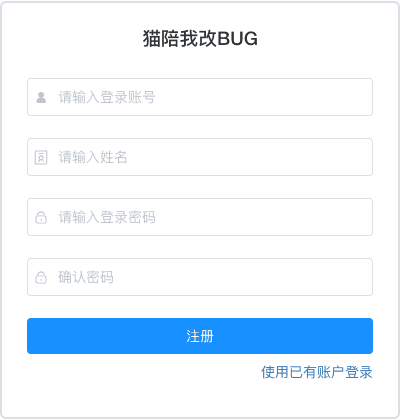

# 注册 [/register](/register)

## 概述

注册功能允许新用户创建系统账号。通过注册，用户可以获得系统访问权限，加入团队和项目，开始使用系统的各项功能。



## 功能说明

### 注册表单

注册页面包含以下必填项：

- **登录账号**：用于登录系统的唯一标识符
- **姓名**：用户的真实姓名或昵称
- **登录密码**：用户的登录密码
- **确认密码**：再次输入密码以确认

手机号码、电子邮件**不在注册页填写**。如需接收邮件或 IM 通知，可在注册并登录后，于 **个人中心 → 基本资料** 中补充（均为选填）。

### 注册步骤

1. 在「登录账号」输入框中输入您想要的账号名
2. 在「姓名」输入框中输入您的姓名
3. 在「登录密码」输入框中设置您的密码
4. 在「确认密码」输入框中再次输入相同的密码
5. 点击「注册」按钮完成注册

### 账号规则

**登录账号要求：**
- 长度：3-20个字符
- 允许使用：字母、数字、下划线
- 必须以字母开头
- 不能包含特殊字符和空格
- 账号一旦创建不可修改

**示例：**
- ✓ 正确：`zhangsan`、`user123`、`test_user`
- ✗ 错误：`123user`（数字开头）、`zhang san`（包含空格）、`user@123`（包含特殊字符）

### 密码规则

**密码要求：**
- 长度：至少6个字符
- 建议包含：大小写字母、数字、特殊字符
- 不能与账号相同
- 不能使用过于简单的密码（如：123456、password等）

**密码强度建议：**
- 弱密码：仅包含数字或字母（如：123456、abcdef）
- 中等密码：包含字母和数字（如：abc123、user2024）
- 强密码：包含大小写字母、数字和特殊字符（如：Abc@123、User#2024）

### 联系方式（注册后补充）

以下信息可在 **个人中心 → 基本资料** 中填写或留空：

- **手机号码**：选填；填写时需为有效格式，且全局唯一；可用于部分通知渠道的默认收件
- **电子邮件**：选填；填写时需为有效格式，且全局唯一；可用于邮件通知的默认收件

若未填写，个人中心对应项会显示「未设置」。在 **通知设置 → 接收平台** 中，系统会提示您在各平台单独配置收件信息。

## 注册后操作

注册成功后：
1. 系统会自动跳转到登录页面
2. 使用刚注册的账号和密码登录
3. 首次登录后，建议完善个人信息（如手机、邮箱，按需填写）
4. 可以创建团队或等待团队邀请

## 注册失败处理

### 常见注册失败原因

**账号已存在**
- 该账号已被其他用户注册
- 请更换其他账号名

**密码不符合要求**
- 检查密码长度是否符合要求
- 确保密码包含必要的字符类型

**两次密码不一致**
- 确认密码必须与登录密码完全相同
- 请仔细核对后重新输入

## 安全建议

- 使用强密码，避免使用生日、电话等容易被猜到的密码
- 不要使用与其他网站相同的密码
- 妥善保管账号密码，不要告诉他人
- 如需接收系统通知，登录后在个人中心填写真实、可用的手机或邮箱

## 键盘快捷键

通用说明见 [键盘快捷键](../../advanced/keyboard-shortcuts.md)。

注册页按住 **⌘/Ctrl** 显示表单字母徽标：

| 字母 | 动作 |
|------|------|
| U | 账号 |
| H | 昵称 |
| P | 密码 |
| D | 确认密码 |
| E | 注册 |
| R | 刷新页面 |

「已有账号登录」等链路的字母请按住 **⌘/Ctrl** 查看界面徽标。

## 常见问题

**Q: 注册后可以修改账号吗？**  
A: 不可以。登录账号一旦创建不可修改，请在注册时仔细选择。

**Q: 为什么注册时不用填手机号？**  
A: 登录仅使用账号与密码。手机、邮箱可在登录后于个人中心按需补充，也可在通知设置里为各平台单独配置收件方式。

**Q: 忘记注册时填写的信息怎么办？**  
A: 可以联系系统管理员查询或重置账号信息。

**Q: 可以使用邮箱注册吗？**  
A: 登录账号不能使用邮箱格式，但可以在个人中心中绑定邮箱（选填）。

**Q: 注册后需要管理员审核吗？**  
A: 不需要审核，注册成功后可联系团队管理员邀请进入团队，或自己创建团队进行管理。

**Q: 手机号、邮箱可以更换吗？**  
A: 可以。登录后在个人中心的基本资料中修改；留空保存即表示清除该项。

## 文档截图说明

维护 `02-register.png` 时，请截取**注册表单卡片**（`.register-form`），与现有用户指南截图风格一致。

| 项目 | 要求 |
|------|------|
| 页面地址 | `http://localhost:2222/#/register`（需开启前端 dev 与后端，且系统已开启公开注册） |
| 截取范围 | 仅白色表单卡片，不含整页背景与页脚版权 |
| 表单字段 | 登录账号、姓名、登录密码、确认密码（**不含**手机号） |
| 主题 | **浅色（白色）主题**：`localStorage['theme-mode']='light'`，且 `html` 无 `dark` class |
| 语言 | 简体中文（默认 locale） |
| 状态 | 空表单、无校验错误、无 loading |
| 输出路径 | `readme/production/images/user-guide/user-management/02-register.png` |

**Playwright 一键截取示例**（在 `cat2bug-platform-ui` 目录执行）：

```bash
node -e "
const { chromium } = require('playwright');
const path = require('path');
(async () => {
  const out = path.resolve('../readme/production/images/user-guide/user-management/02-register.png');
  const browser = await chromium.launch({ channel: 'chrome', headless: true });
  const page = await browser.newPage({ viewport: { width: 1280, height: 800 } });
  await page.addInitScript(() => {
    localStorage.setItem('theme-mode', 'light');
  });
  await page.goto('http://127.0.0.1:2222/#/register', { waitUntil: 'networkidle' });
  await page.evaluate(() => {
    document.documentElement.classList.remove('dark');
    document.documentElement.style.colorScheme = 'light';
  });
  await page.waitForSelector('.register-form');
  await page.locator('.register-form').screenshot({ path: out });
  await browser.close();
  console.log('saved', out);
})();
"
```
