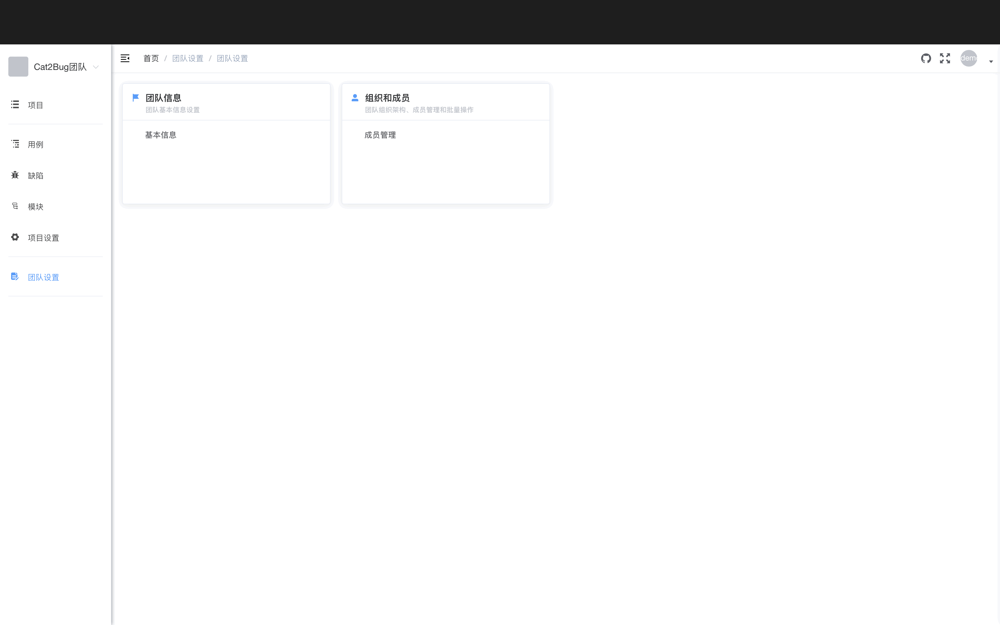
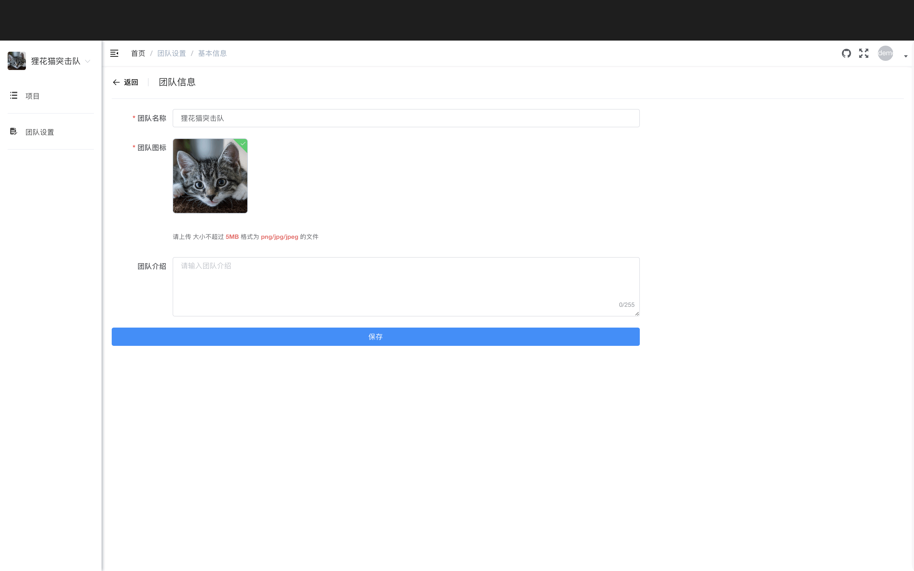
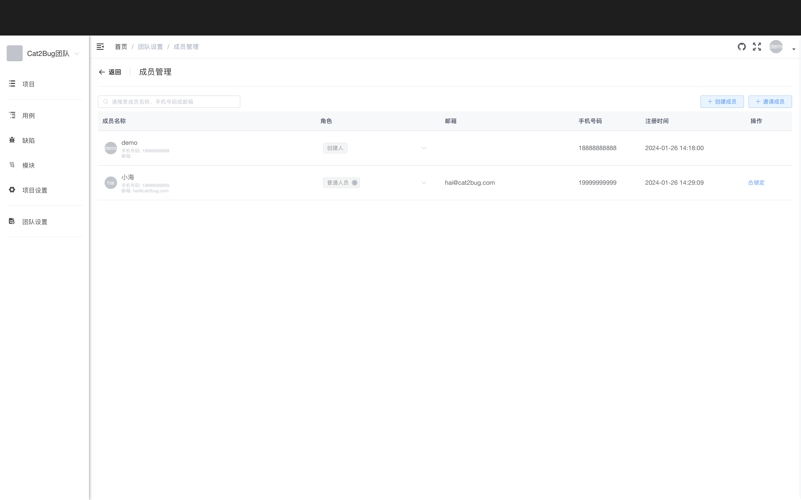
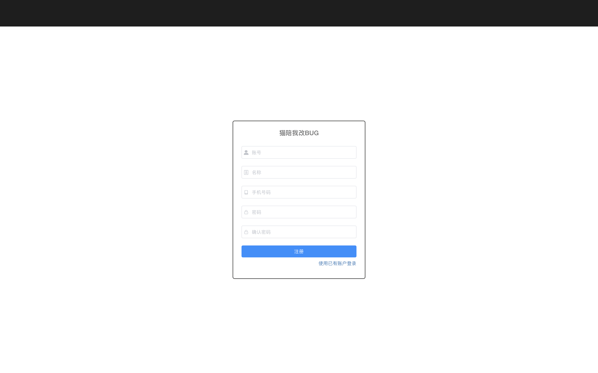
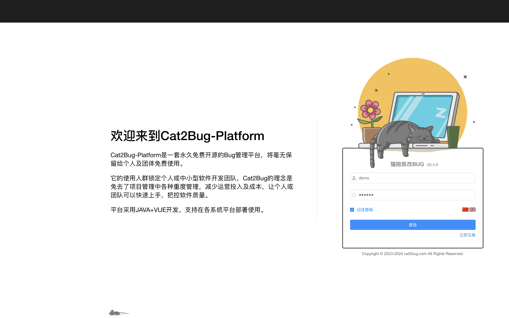
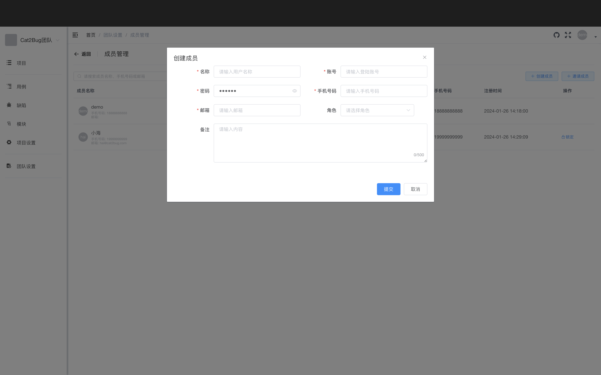
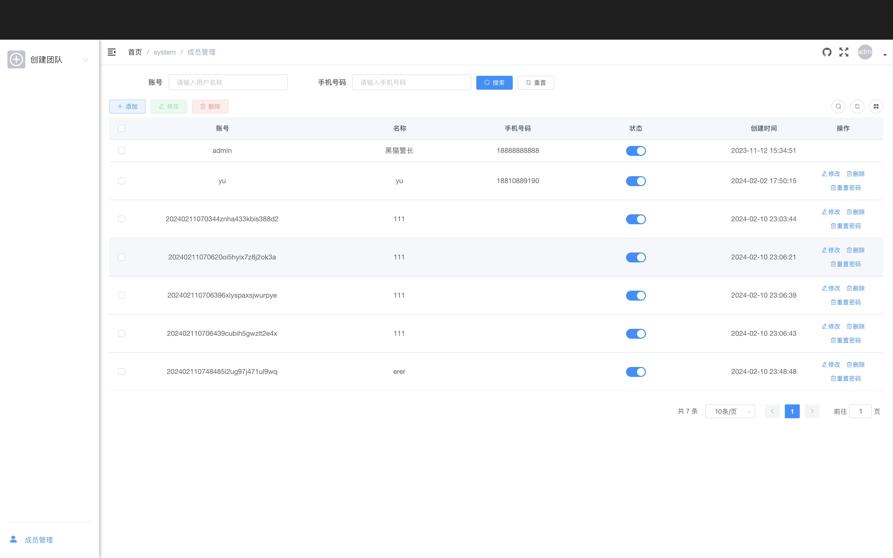

# 团队设置

团队设置是管理当前团队基础信息及相关数据的页面，如下图：

## 访问团队设置

点击左侧菜单栏中的【团队设置】菜单，在右侧选择相应的设置项。

## 团队信息

团队信息是维护团队名称、图标、备注等信息的页面，如下图：

**可修改内容：**

- 团队名称
- 团队图标
- 团队介绍
- 团队状态

**修改步骤：**

1. 在团队设置页面选择【团队信息】
2. 修改相应的信息
3. 点击【保存】按钮

## 成员管理

项目中的成员管理用于维护哪些人员可以访问团队，目前可以通过直接创建、邀请两种方式添加成员。

### 注册

新用户可以通过注册功能创建自己的账号。

**注册步骤：**

1. 在登录界面，点击【注册】快捷按钮，跳转到注册界面

2. 填写注册信息
   - **账号**（必填）- 用于登录的用户名，只能包含字母、数字、下划线
   - **名称**（必填）- 显示名称，可以使用中文
   - **密码**（必填）- 登录密码，建议使用字母、数字、特殊字符组合
   - **确认密码**（必填）- 再次输入密码确认
   - **手机号**（可选）- 用于找回密码和接收通知

3. 点击【注册】按钮进行注册
4. 注册成功后自动跳转到登录界面

### 登录

目前系统只支持通过账号和密码方式登录，如下图：

**登录步骤：**

1. 访问系统登录页面
2. 输入账号和密码
3. 点击【登录】按钮
4. 登录成功后进入系统首页

**记住密码：** 勾选【记住密码】选项，下次登录时会自动填充账号和密码。

::: warning 注意
在公共电脑上不建议使用记住密码功能
:::

### 从团队中创建成员

为了方便组织管理，系统提供了由团队管理员创建成员的功能。

**创建步骤：**

1. 在团队设置页面选择【成员管理】
2. 点击【创建成员】按钮
3. 填写成员信息
   - **账号**（必填）- 用于登录的用户名
   - **名称**（必填）- 显示名称
   - **密码**（必填）- 初始密码
   - **手机号**（可选）- 联系电话
   - **邮箱**（可选）- 电子邮箱
   - **角色**（必填）- 选择团队角色（团队管理员、团队普通人员）
4. 点击【提交】按钮
5. 创建成功后，新成员会出现在成员列表中

**创建后的默认设置：**
- 新成员可以立即使用账号和密码登录
- 建议新成员首次登录后修改密码
- 新成员会自动加入当前团队

### 密码找回

当用户忘记密码时，可通过系统管理员角色找回。

**找回步骤：**

1. 系统管理员登录系统
2. 系统菜单将在左侧菜单栏的底部显示
3. 点击【成员管理】菜单
4. 在右侧成员列表中查找需要恢复密码的成员
5. 点击操作列中的【重置密码】选项
6. 确认重置操作
7. 密码将恢复到出厂设置

::: tip 提示
默认重置的密码为：123456

如用户想修改重置后的默认密码，可自行登录后，在页面右上角的【个人中心】中修改。
:::

### 添加成员到项目

**添加步骤：**

1. 在项目设置页面选择【成员管理】
2. 点击【添加成员】按钮
3. 从团队成员中选择要添加的成员
4. 设置项目角色
5. 提交添加

### 修改成员角色

1. 在成员列表中找到要修改的成员
2. 点击【编辑】按钮
3. 修改角色设置
4. 点击【保存】

### 锁定/解锁成员

**锁定成员：**
- 锁定后成员无法登录系统
- 适用于临时禁用账号
- 可以随时解锁

**操作步骤：**
1. 在成员列表中找到要锁定的成员
2. 点击【锁定】按钮
3. 确认锁定操作

### 移除成员

**从团队移除：**
- 移除后成员无法访问团队和团队下的所有项目
- 成员账号仍然存在，可以加入其他团队

**从项目移除：**
- 移除后成员无法访问该项目
- 成员仍然是团队成员，可以访问其他项目

**操作步骤：**
1. 在成员列表中找到要移除的成员
2. 点击【移除】按钮
3. 确认移除操作

## 团队中的成员权限

在团队相关功能中，设置了"团队创建人"、"团队管理员"、"团队普通人员"三种角色。

**角色说明：**

- **团队创建人** - 拥有所有当前团队和项目的操作权限
- **团队管理员** - 除删除外的所有当前团队和项目的操作权限
- **团队普通人员** - 拥有创建自己团队和项目的权限

详细的权限对照表请参考[团队管理文档](./team-manage.md#团队权限详细说明)。

## 项目中的成员权限

在项目相关模块中，设置了"项目创建人"、"项目管理员"、"开发"、"测试"、"外部人员"5种角色。

**角色说明：**

- **项目创建人** - 拥有当前项目所有权限，可以理解为项目管理中的"项目发起人"
- **项目管理员** - 拥有除删除外的所有项目权限
- **开发** - 拥有修复缺陷的权限
- **测试** - 拥有测试用例、缺陷的所有权限
- **外部人员** - 用于查看项目进度，一般设定为甲方客户

### 权限对照表

| 权限 | 项目创建人 | 项目管理员 | 开发 | 测试 | 外部人员 |
|------|:--------:|:--------:|:---:|:---:|:------:|
| 创建项目 | ✓ | ✓ | | | |
| 修改项目 | ✓ | ✓ | | | |
| 查看项目 | ✓ | ✓ | ✓ | ✓ | ✓ |
| 删除项目 | ✓ | | | | |
| 项目API管理 | ✓ | ✓ | | | |
| AI大模型管理 | ✓ | ✓ | | | |
| 项目成员管理 | ✓ | ✓ | | | |
| 创建测试用例 | ✓ | ✓ | | ✓ | |
| 修改测试用例 | ✓ | ✓ | | ✓ | |
| 查看测试用例 | ✓ | ✓ | | ✓ | |
| 删除测试用例 | ✓ | ✓ | | ✓ | |
| 导入测试用例 | ✓ | ✓ | | ✓ | |
| 创建缺陷 | ✓ | ✓ | | ✓ | ✓ |
| 修改缺陷 | ✓ | ✓ | | ✓ | ✓ |
| 查看缺陷 | ✓ | ✓ | | ✓ | ✓ |
| 删除缺陷 | ✓ | ✓ | | ✓ | |
| 指派缺陷 | ✓ | ✓ | ✓ | ✓ | |
| 修复缺陷 | ✓ | ✓ | ✓ | ✓ | |
| 驳回缺陷 | ✓ | ✓ | | ✓ | |
| 通过缺陷 | ✓ | ✓ | | ✓ | |
| 关闭缺陷 | ✓ | ✓ | | ✓ | |
| 开启缺陷 | ✓ | ✓ | | ✓ | |
| 创建交付物 | ✓ | ✓ | | ✓ | |
| 修改交付物 | ✓ | ✓ | | ✓ | |
| 查看交付物 | ✓ | ✓ | | ✓ | |
| 删除交付物 | ✓ | ✓ | | ✓ | |
| 查看报告 | ✓ | ✓ | ✓ | ✓ | |
| 查看文档 | ✓ | ✓ | ✓ | ✓ | |
| 更新文档 | ✓ | ✓ | | | |
| 删除文档 | ✓ | ✓ | | | |

::: warning 注意
当前版本中，角色中的权限无法自定义设置，如果一个成员在实际工作中身兼数职，可以同时设置多个角色。
:::

## 个人中心

个人中心是管理个人信息和设置的地方。

### 访问个人中心

点击页面右上角的头像，选择【个人中心】。

### 个人信息

查看和修改个人基本信息：

- **头像** - 上传个人头像
- **名称** - 修改显示名称
- **手机号** - 修改联系电话
- **邮箱** - 修改电子邮箱
- **个人简介** - 填写个人介绍

### 修改密码

修改登录密码：

1. 输入旧密码
2. 输入新密码（6-20位）
3. 确认新密码
4. 点击【保存】

**密码安全建议：**
- 使用字母、数字、特殊字符组合
- 不要使用生日、电话等容易被猜到的密码
- 定期更换密码
- 不要在多个系统使用相同密码

### 通知设置

配置接收通知的方式和类型：

**通知方式：**
- 系统内通知
- 邮件通知（需要配置邮箱）
- 短信通知（需要配置手机号）

**通知类型：**
- 缺陷分配给我
- 缺陷状态变更
- 测试用例分配给我
- @我的评论
- 项目成员变更

## 常见问题

### Q: 如何添加团队成员？

A: 在团队设置的【成员管理】中，可以通过【创建成员】按钮直接创建新成员账号，或者邀请已有用户加入团队。

### Q: 如何修改团队信息？

A: 在团队设置的【团队信息】中可以修改团队名称、图标、介绍等信息。

### Q: 忘记密码怎么办？

A: 请联系系统管理员重置密码。重置后的默认密码为 123456，建议登录后立即修改。

### Q: 如何给成员分配项目角色？

A: 在项目设置的【成员管理】中，添加成员时可以选择角色，或者编辑已有成员修改其角色。

### Q: 外部人员可以做什么？

A: 外部人员可以查看项目信息、查看和创建缺陷，但不能执行测试用例、不能删除缺陷。主要用于让甲方客户查看项目进度。
